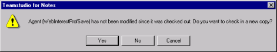

# Checking an Element In
You check an element in to make the element available for check-out. Checking an element in saves a copy of the element into the log database. This allows you to roll back to that change in the future. Each time you check an element in, CIAO! stores the following:

* Issues
* A copy of the element you are checking in
* The comment you attach to it
* A record of who made the check-in operation
* When the check-in operation occurred

## Checking in a Single Element
If you entered a check-out comment, and you are only checking in a single element, then CIAO! uses this check-out comment as the default. 

## To check a design element in
1. In Designer, open the database you want to work with.
2. Click the CIAO! button on the toolbar.  
   Design elements that have been changed display in blue by default in the CIAO! main window.
3. Select the design elements you want to check in.
   

     
Note

     
If you are using Notes 8.5.1 or later, CIAO! automatically recognizes which element you have open in designer and highlights it.

   

4. From the **CIAO!** menu, choose **Check In**. You see the Enter Check In Comment window.
   
5. Enter the check-in comment and click OK.

!!! note
    You can check in multiple elements at the same time by selecting the elements you want to check in, and then choosing **Check In** from the **CIAO!** menu.  
    If using an uncategorized view, you select multiple elements at once by holding down the **CTRL** or **Shift** key while selecting. To check in all elements that are checked out to you, click the **Owner** column in the CIAO! main window. This sorts the display of elements alphabetically by owner (that is, who has the element checked out), making it easier to select all of the elements that you currently have checked out.  
    If using a categorized view, you select multiple elements by clicking to select their check boxes. 

You may find it convenient to select multiple elements, then check them in, rather than check in one at a time. If you are checking in multiple elements, you see the following window. 
<figure markdown="1">
  
</figure>

The **Keep checked out** check box lets you make new versions of the elements, but keep them checked out. This is useful if you want to save your changes, yet continue working on the same elements. 

The **Use Checkout Comment** check box lets you automatically use the checkout comment as the Check In comment.

!!! note
    If you are checking in multiple elements together, the check-out comment will not be displayed as the default check-in comment. 
 
When checking in multiple elements, including some that you haven't modified, you see a message, offering two additional options: **Yes to all** and **No to all**. Click one of these buttons if you do not want to check in each element individually.
!!! note
    The **No to all** button only applies to elements that have not been modified. 
    
## To check in an unchanged design element
You may check in an element, even if you have not changed it. If you have not made any changes to the design element since you checked it out, you see a message asking if you want to check in a new copy (that is, make a new version).
<figure markdown="1">
  
</figure>

You see a similar message if you are checking in multiple elements. 
<figure markdown="1">
  
</figure>

* Click **Yes**, or **Yes to all** if you want to check in the element and have CIAO! make a new version of the element, which is exactly the same as the previous version.
* Click **No**, or **No to all** if you if you want to check in the element without making a new version.
* Click **Cancel** to cancel the check in and to keep the element checked out.