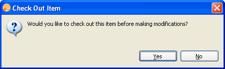
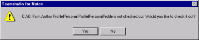
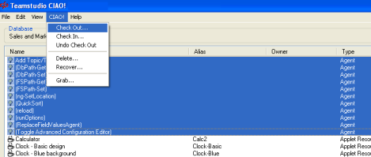
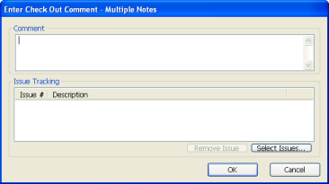
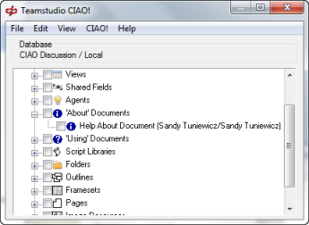
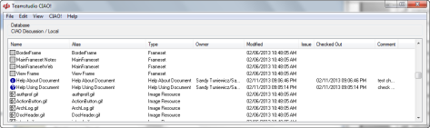
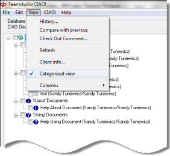
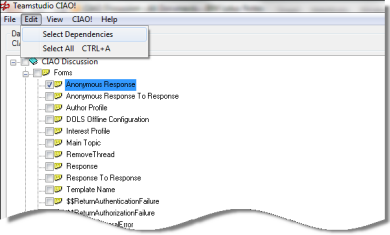
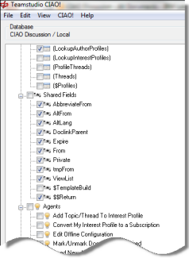

# 要素のチェックアウト

監視下のデータベースの設計を変更する前に、変更に関係するすべての設 計要素をまとめてチェックアウトすると、他のユーザーが作業している チェックアウト要素を待つ必要がなくなります。

Domino Designer 8.5.1 以降を使用している場合、要素に変更を加えようとす ると、要素をチェックアウトするように求められます。
<figure markdown="1">
  
</figure>

Domino Designer のバージョン 8.5.1 より前を使用している場合、チェックアウトしていない要素に変更を加えると、保存時にチェックアウトするよう求められます。
<figure markdown="1">
  
</figure>

## 設計要素をチェックアウトするには
設計要素をチェックアウトして、他の開発者が変更を上書しないようにし ます。次の手順で設計要素をチェックアウトできます。

1. Designer で、作業するデータベースを開きます。
2. ツールバーの[CIAO!]ボタンをクリックします。
3. CIAO! から、チェックアウトする設計要素の名前をクリックして、設計要素を 選択します。  
   

     
Note

     
ノーツ 8.5.1 以降を使用している場合、Designer で選択した要素が CIAO! により自動的に認識されて、強調表示されます。

   

4. [CIAO!] メニューから、[ チェックアウト ] を選択します。
    * カテゴリ別表示ビューで複数の設計要素を選択するには、設計要素のチェックボックスをオンにします。カテゴリ別表示でないビューを使用しているときは、**SHIFT** キー、または **CTRL** キーを押したまま各要素をクリックします。
    * 設計要素を右クリックしてショートカットメニューを表示し、**[ チェッ クアウト ]** をクリックできます。 
    * 設計要素がテンプレートにリンクしている場合は、チェックアウトで きません。要素とリンクしているテンプレートは、その要素のユー ザーとして表示されます。
    * テンプレートにリンクする要素をチェックアウトできるようにする には、CIAO! 設定データベースを開き、[Watch Linked] フィールドを [Yes] に設定します。詳細については[ テンプレートとテンプレートにリンクする要素の使い方](templates.md)を参照してください。
    * CTRL+A または [ 編集 ] > [ すべて選択 ] を使用してすべての設計要 素を選択するか、カテゴリ別表示ビューでデータベース名の横の チェックボックスをオンにします。 
  
[ チェックアウトコメントの入力 ] ウィンドウが表示されます。  

5. 設計要素の変更について説明するコメントを入力します。  
   

     
Note

     
IfCIAO! 設定データベースで作業中のデータベースに対して <b>[ チェックア ウトの実行時に問題の選択を必須とする ]</b> チェックボックスをオンにし ている場合、チェックアウトに問題を割り当てる必要があります。

     
CIAO! 設定データベースで作業中のデータベースに対して <b>[ 必須コメン ト ]</b> オプションをオンにしている場合は、チェックアウト時にコメント を入力する必要があります。

   

   
!!! note
    設計要素を開き、変更を加えて、保存する直前だけ要素をチェックア ウトすることはできますが、推奨されません。要素を開いている間に 別のユーザーがその要素をチェックアウトした上で変更を行い、 チェックインで元に戻したという可能性もあるため、他のユーザーの 変更を上書きする場合があります。このため、変更を行うときは必ず その前にチェックアウトしてください。  
    他のユーザーがファイルをチェックインしなかった場合に、CIAO! の 外部でそのファイルを変更すると、ファイルをチェックインできなく なります。
 
## チェックアウトされた設計要素を表示するには
チェックアウトされた設計要素を表示すると、目的の設計要素で作業して いるユーザーを確認できます。チェックアウトされた設計要素は、次の手 順で表示できます。

1. Designer で、作業するデータベースを開きます。
2. ツールバーの[CIAO!]ボタンをクリックします。  
   [CIAO!] ウィンドウに、開いているデータベースの名前、設計要素、各要素を チェックアウトしたユーザーが表示されます。  
     
   カテゴリ別表示でないビューに変更すると、列の情報を並べ替えることができ ます。 
     
   列の見出しをクリックして、一覧を並べ替えることができます。また、列の見 出しの横をドラッグして、列の幅を変更することもできます。列の見出しの境 界線をダブルクリックすると、内容に合わせて列の幅を最適化できます。  
   

     
Note

     
マウスポインタを要素の上に置くと、その要素のユーザー、チェックアウ トの日付、およびコメントが表示されます。

     
   

## 他のユーザーが入力したチェックアウトコメントを表示するには
要素の現在の所有者が加えている変更の種類を参照するには、チェックア ウトコメントを表示します。次の手順でチェックアウトコメントを表示で きます。

1. チェックアウトされている要素を選択します。
2. **[ 表示 ]** メニューから、**[ チェックアウトコメント ]** を選択します。  
    

!!! note
    自分がチェックアウトした設計要素のコメントは編集できます。他の開発者のコメントは読み取り専用です。
    
## 他の設計要素を使用する設計要素をチェックアウトするには
他の設計要素を使用する設計要素(たとえば、フォームとそのサブフォー ムなど)をチェックアウトすると、関連する要素に適切な変更を加えて、他 のユーザーが変更しないようにできます。

1. メインとなる設計要素(たとえば、フォームなど)をクリックして選択します。
2. **[ 編集 ]** メニューから **[ 従属要素を選択 ]** を選択します。  
     
   従属する設計要素(たとえば、サブフォームなど)も選択されます。  
   
3. **[CIAO!]** メニューから、**[ チェックアウト ]** を選択します。 選択した要素すべてがチェックアウトされます。