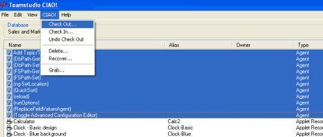
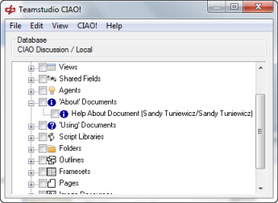
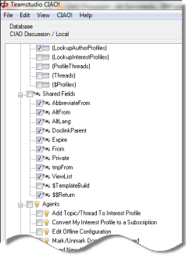

# Checking an Element Out

Before you can make changes to the design of a watched database, make sure that you check out all the design elements associated with your changes together, so you won't later be stuck waiting to check out elements that someone else is working on.

If you are using Domino Designer 8.5.1 or later, CIAO! prompts you to check an element out when you begin to make changes to it.
<figure markdown="1">
  
</figure>

If you are using Domino Designer versions earlier than 8.5.1 and you make changes to an element that is not checked out, CIAO! asks you to check it out when you go to save it. 
<figure markdown="1">
  
</figure>

## To check design elements out
You check design elements out so no other developers will overwrite your changes. You can check design elements out as follows:

1. In Designer, open the database you want to work with.
2. Click the CIAO! button on the toolbar.
3. From CIAO!, select the design elements you want to check out by clicking the design element's name.
   

     
Note

     
If you are using Notes 8.5.1 or later, CIAO! automatically recognizes which element you have selected in designer and highlights it.

   

4. From the CIAO! menu, select **Check Out**.
    * To select multiple design elements in a categorized view, click their check boxes, or, if using an uncategorized view, use the **SHIFT** or **CTRL** key as you click each element.
    * You can right-click a design element to display the shortcut menu, and select **Check Out**. 
    * If a design element is template-linked, you cannot check it out. The template to which the element is linked is listed as the owner of the element.
    * To allow template-linked elements to be checked out, open the CIAO! Configuration database and set the Watch Linked field to **Yes**. See [Working with Templates and Template-linked Elements](templates.md), for more information.
    * Use CTRL+A or Edit > Select All to select all design elements, or, in a categorized view, check the box beside the database name.  
  
You see the **Enter Check Out Comment** window.  

5. Enter a comment describing the changes you are making to the design element.  
   

     
Note

     
If the <b>An Issue is Required When Checking Out</b> option is checked in the CIAO! configuration database for the database you are working on, you must assign an issue to the check-out.

     
If the <b>Mandatory Comment</b> option is checked in the CIAO! configuration database for the database you are working on, you must enter a comment for the check-out.

   

   
!!! note
    Although you can open a design element, make changes, and only check the element out just before saving it, we do not recommended this. Since someone else may have checked the element out, made changes and checked it back in while you had the element open, you would over-write the other person's changes. Consequently, we strongly recommend that you check an element out before you change it.  
    If someone has not checked a file in, and you change that file outside of CIAO!, then you cannot check the file in. 
 
## To view the design elements checked out
You view design elements checked out so you can see who is working with the design elements you are interested in. You can view the design elements checked out as follows:

1. In Designer, open the database you want to work with.
2. Click the CIAO! button on the toolbar.  
   You see the CIAO! window with the name of the open database, the design elements, and who has each element checked out.  
     
   If you change to the non-categorized view, you can sort the information in columns. 
     
   You can sort the list by clicking a column heading. You can also resize the column widths by dragging the side of the column header. Double-clicking on the column header divider will adjust the column width to best fit the contents. 
   

     
Note

     
You can view an element's owner, date checked out and comment by hovering your mouse pointer over the element.

     
   

## To view the check-out comment that someone else provided
You view check-out comments to see the type of changes the current owners of the elements say they are making. You can view check-out comments as follows:

1. Select the checked out element.
2. From the **View** menu, choose **Check Out Comment**.  
    

!!! note
    You can edit comments for design elements that you checked out. Comments written by other owners are read-only.
    
## To check out a design element that uses other design elements
You check out a design element that uses other design elements, for example, a form and its subforms, so you can make appropriate changes to related elements and you can be sure that others do not make changes to them.

1. Select the main design element (for example, the form) by clicking it.
2. Choose **Select Dependencies** from the **Edit** menu.  
     
   Any dependent design elements (for example, subforms) are also selected.  
   
3. From the **CIAO!** menu, choose **Check Out**. All selected elements are checked out.