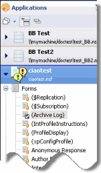
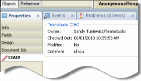
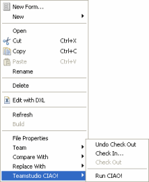

# Domino Designer での CIAO! の認識

Domino Designer 8.5.1 または 9.0 を、Domino パースペクティブや Package Explorer ビューで使用される他のパースペクティブで使用している場合、次 の表で説明する CIAO! の状態を示すアイコンが、データベース要素の横に 表示されます。

| アイコン | CIAO! の状態 |
| --- | --- |
|  | CIAO! の監視下 |
|  | 自分に対してチェックアウト中 |
|  | 他のユーザーに対してチェックアウト中 |
 
<figure markdown="1">
  
</figure>

CIAO! の監視下の要素を選択すると、[ プロパティ ] タブの CIAO! セクショ ンに、要素の所有者、チェックアウトコメント、チェックアウト日時、お よび要素が変更されているかどうかが表示されます。
<figure markdown="1">
  
</figure>

さらに、データベースナビゲータペイン内を右クリックすると、ショート カットメニューが表示され、CIAO! にアクセスしてチェックアウトの取り 消し、チェックイン、チェックアウト、または CIAO! の実行を行うことができます。 
<figure markdown="1">
  
</figure>
