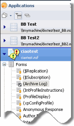
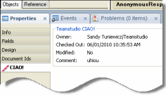

# CIAO!-Awareness in Domino Designer

When using Domino Designer 8.5.1 or above, in the Domino perspective and other perspectives that use the Package Explorer view, you will see database elements with icons beside them that represent a CIAO! status as described in the following table:

| Icon | CIAO! Status |
| --- | --- |
|  | CIAO!-watched |
|  | Checked out to me |
|  | Checked out to someone else |
 
<figure markdown="1">
  
</figure>

When you select a CIAO!-watched element, you'll see a CIAO! section of the Properties tab which displays the element's owner, checkout comment, date/time checked out, and whether or not the element has been changed. 
<figure markdown="1">
  
</figure>

Additionally, by right-clicking within the Database Navigator pane, you display the shortcut menu where you can access CIAO! to Undo Check Out, Check In, Check Out or Run CIAO!. 
<figure markdown="1">
  
</figure>
