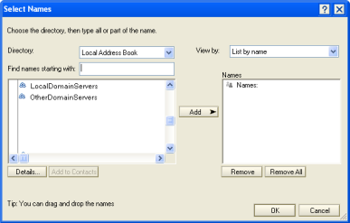

# CIAO! の機能へのアクセス権の割り当て

権限のないユーザーが、CIAO! 設定データベースからバージョン作成やグラブなどの CIAO! 機能にアクセスするのを防ぐことができます。

# アクセス権を割り当てるには
1. CIAO! 設定データベースから、編集するデータベース設定文書を開きます。
2. **[ 権限 ]** タブをクリックします。  
   **[CIAO! の権限 ]** ウィンドウが表示されます。  
   
3. 割り当てるアクションのアクセス権限を設定します。どの場合も、[ 名前の選択 ] ウィンドウが表示されます。
– 各機能を実行するユーザーの名前またはグループを追加します。  
   その際、ユーザー全員がアクセスできるアドレス帳から選択することをお勧めします。手動入力による誤ったユーザー名の指定は、CIAO! がユーザーをロックアウトしてしまう可能性があります。  
    

!!! note
    フィールドを空白にすると、すべてのユーザーがその機能を実行できるようになります。 
 