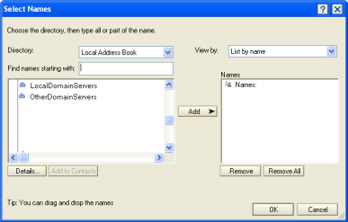

# Assigning CIAO! Feature Access

You can prevent unauthorized access to CIAO! features such as Make Version and Grab through the CIAO! Configuration database.

# To assign access
1. From the CIAO! Config database, open the database configuration document for editing.
2. Click the **Authority** tab.  
  You see the **CIAO! Authority** window.  
  
3. Set the access authority for the action you want to assign. In each case, you see the **Select Names** window.  
   We recommend that you choose from an address book to which everyone has access. Otherwise, some people may be locked out because CIAO! cannot resolve the names specified.  
    

!!! note
    Leaving the field blank allows anyone to perform that function. 
 