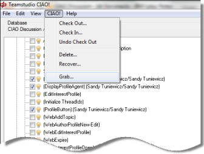

# What if I need an element someone else has checked out?

Occasionally you may find it necessary to check a design element out, even though someone else has already checked it out. For example: someone made changes to a set of design elements and saved the changes back in the master copy of the database. Then, that person left for a two-week vacation without checking those changes back in. Unless you had access to that person's Notes ID file, you could not get the changes checked back in to release the locks on the design elements. All elements must be checked in before you can save and create a new version of the design.

The Grab feature allows you to check a design element out, even though it is already checked out by someone else.
<figure markdown="1">
  
</figure>

You can avoid a difficult situation using the Grab feature. CIAO! lets you grab one or more design elements, checking them out to yourself, even though they may be checked out to someone else. Use this feature with care, since if the person who had the design elements checked out has not saved his or her changes back in the master copy of the database, those changes will be lost.

When you grab a design element, CIAO! saves a copy of the checked-out element to the CIAO! log database with the Grab comment.

The Grab feature can be restricted from certain users by using a grab-disabled serial key. CIAO! comes with a grab-enabled serial key. To get a free grab-disabled key, please contact Teamstudio with your product serial number. Another way to restrict access to the grab feature is through the CIAO! Config database. See [Assigning CIAO! Feature Access](featureaccess.md) for more information.