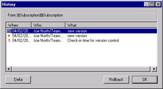

# 要素の履歴の使い方

要素で作業したユーザーと、加えられた変更を確認するには、要素の履歴 を表示します。[ 履歴 ] ウィンドウでは、2 つのバージョン間の変更内容の 表示や前のバージョンへのロールバックを選択することもできます。

## 設計要素の履歴を表示するには
設計要素の履歴は、次の手順で表示できます。

1. CIAO! から、履歴を表示する設計要素を選択します。
2. CIAO! の [ 表示 ] メニューから [ 履歴 ] を選択します(または設計要素をダブル クリックします)。前に星印の付いた項目は、チェックインではなく、バージョンを示します。
3. オプションとして、**[バージョンラベルを表示]**ボックスをオンにして、ロール バックではなくバージョンの情報を表示します。
   
   

     
Note

     
バージョンをロールバックすることはできません。ロールバックは過去 のチェックイン操作に限られます。バージョンは、ブックマーク、また はプレースホルダーのような機能を果たします。バージョンの作成を実 行すると、過去のバージョンが存在しない場合にだけこの新しいバー ジョンが作成されます。

   

要素に過去バージョンがない(つまり、今まで要素がチェックインされていない)場合は、要素の過去のバージョンがログファイルにないことを示すメッ セージが表示されます。
 
## 履歴テキストをクリップボードにコピーするには
[ 履歴 ] ウィンドウ内の行項目をダブルクリックすると、履歴の詳細が表示されます。次の手順で、情報をクリップボードをコピーして他の場所で使 用できます。

1. **[ 履歴 ]** ウィンドウで項目をダブルクリックします。  
   **[ 情報 ]** ウィンドウが表示されます。  
   
2. 次のいずれかを行います。
    * テキストをすべてクリップボードにコピーするには、**[コピー]**をクリックし ます。
    * 選択したテキストだけをクリップボードにコピーするには、テキストの一部 を選択して **Ctrl+C** キーを押します。

## 要素の 2 つのバージョンを比較するには
設計要素の 2 つのバージョンは、次の手順で比較できます。

1. **[ 履歴 ]** ウィンドウで、1 つ目のバージョンを選択し、CTRL キーを押しながら 比較する 2 つ目のバージョンをクリックします。  
   
2. [Delta] ボタンをクリックします。  
     
   選択した 2 つの要素が、Delta メインウィンドウに並べて表示されます。両ペイ ンのウィンドウはシンクロナイズされます。したがって、一方のペインをスク ロールすると、他方のペインも同じようにスクロールされます。プラス/マイナス記号をクリックすることによって、見出しを展開または省略できます。要 素一覧を展開するには、各ペインでプラス記号をクリックします。対応する要 素は常に同じ位置で並んで表示されます。対応する設計要素は、常に同一名で同一タイプになります。 
   右向きの矢印は、データベース 2 にだけ要素が存在することを示します。逆に データベース 1 の要素に対応する要素がデータベース 2 にないとすると、デー タベース 2 の対応行は空白になります。左向きの矢印は、データベース 1 にだ け要素が存在することを示します。下位レベルを順に表示するには、プラス記 号を続けてクリックします。すべて展開するには、テンキーのアスタリスク キーを押します。

詳しくは [要素または文書の比較](../delta/comparing.md)を参照してください。

## 要素の過去バージョンを復元するには
要素で作業する際、その要素を過去のバージョンに戻してやり直すのが最 善と思われる場合があります。要素の過去バージョンは、次の手順で復元 できます。

1. 設計要素の過去バージョンを表示するには、CIAO!を開き、設計要素の名前を ダブルクリックします。選択した要素が少なくとも 1 回チェックインされている場合は、[ 履歴 ] ウィン ドウが表示されます。  
     
   **[ 履歴 ]** ウィンドウでは、要素の過去バージョンすべてがチェックインされた日付順に表示されます。
2. 復元するバージョンの日付を選択し、[ロールバック]をクリックします。
 
!!! note
    過去バージョンにロールバックするには、要素がチェックアウトされている 必要があります。これは、チェックアウトできない削除済みの要素には当て はまりません。