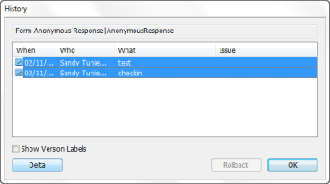

# Working with Element History

You view an element's history to see who has been working on an element and what changes they have made. From the History window you can also choose to view changes between two versions or rollback to a previous version.

## To view the history of a design element
You can view the history of a design element as follows:

1. From CIAO!, select the design element you want to view the history of.
2. From the CIAO! **View** menu, choose **History** (or double-click the design element). Items prefixed by a star symbol indicate a version, rather than a check-in.
3. Optionally, check the **Show Version Labels** box to see versions for your information and not for roll back.  
   
   

     
Note

     
You cannot rollback a version. You can only rollback to a previous check-in operation. A version merely acts like a bookmark or placeholder. When you perform a Make Version operation, a new version of this element is created only if no previous version exists.

   

If no previous versions of the element have been stored, that is, the element has not been checked in, you see the a message telling you that there are no previous versions of the element in the log file.
 
## To copy History text to the clipboard
When you double-click a line item within the History window, you see history details. You can copy the info to the clipboard to use elsewhere as follows:

1. Double-click an item in the History window.  
   You see the Info window.  
   
2. Do one of the following:
    * Click **Copy Info** to copy all of the text to the clipboard.
    * Select some text and press **Ctrl+C** to copy only the selected text to the clipboard.

## To compare two versions of an element
You can compare any two versions of a design element as follows:

1. In the **History** window, click to select a version and then hold down the **CTRL** key while you click the second version to compare.  
   
2. Click the Delta button. You see the Delta window.  
     
   You see the two elements you chose to compare displayed side-by-side in the Delta window. The windows in the two panes are synchronized, so that as you scroll through one, the other scrolls with it. You can expand or collapse headings by clicking the plus/ minus signs. To expand the list of elements, click the plus sign in either pane.  
   Corresponding elements are always listed side-by-side. Corresponding design elements always have identical names and are of the same type.  An arrow pointing right indicates that the element exists in Database 2 only. If there is no corresponding element in Database 2 to an element in Database 1, the corresponding line in database 2 is blank. An arrow pointing left indicates that the element exists in Database 1 only. To drill down to successively lower levels of detail, continue clicking plus signs. To expand everything, press the asterisk key on the numeric keypad.

See [Comparing Elements or Documents](../delta/comparing.md), for more information.

## To restore a previous version of an element
While working with an element, you may decide it is best to start fresh with a previous version of that element. You can restore a previous version of an element as follows:

1. To view previous versions of any design element, open CIAO! and double-click the name of the design element.  
   If the selected element has been checked in at least once, you see the **History** window.  
     
   In the **History** window, all previous versions of the element are sorted by check-in date.
2. Select the date of the version you want to restore and click **Rollback**.
 
!!! note
    You must have the element checked out before you can rollback to a previous version. This does not apply to deleted elements, which you cannot check out.