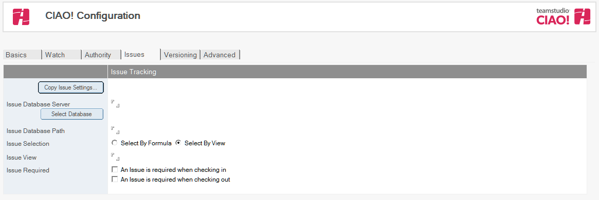

# 紹介

問題追跡データベースでは、要素の変更を問題に関連付けることが重要です。要素をチェックインまたはチェックアウトするとき、作業していた問題を確認することができます。

## ビューにより問題を選択するには
次の手順で問題を表示するビューを表示することができます。

1. CIAO! の [ 設定 ] ページの **[ 問題 ]** タブで、**[ 問題データベースのサーバー ]** を 選択します。
2. [ ビューによる選択 ] ラジオボタンをクリックします。  
   **[ 問題ビュー ]** フィールドと **[ ビューの選択 ]** ボタンが表示されます。  
   
3. [ ビューの選択 ] ボタンをクリックします。  
   [ ビューの選択 ] ウィンドウが表示されます。  
   
4. 問題を表示するビューを選択します。  
   

     
Note

     
ビューの最初の 2 列はテキストタイプにする必要があります。最初の列は問題番号に使用し、2 番目の列は問題の説明に使用します。

   

5. **[OK]** をクリックします。

## 式により問題を選択するには
問題追跡データベースが非常に大きいか、作業に関連するビューがない場合、式を使用して選択可能な問題を判断できます。

1. CIAO! の [ 設定 ] ページの **[ 問題 ]** タブで、**[ 式で選択 ]** ラジオボタンをクリッ クします。  
2. [ 問題式 ] フィールドに、ノーツ選択式を入力します。  
   <table><tr><th>Formula Example</th><td>問題追跡データベースに任命者というフィールドがある場合、現在のアプリケーションの作業を行う現在のユーザーに関連する問題のみを表示することができます。これには、次の式を使用します。 Product="app.ntf"|@username=AssignedTo  注記: ここでは問題データベースに、アプリケーションのファイル名 を含む「Product」というフィールドと、正規ユーザー名を含む 「AssignedTo」というフィールドが含まれることを想定しています。</td></tr></table>
3. **[ 問題番号 ]** フィールドに、問題を特定するフィールドの名前(問題追跡データ ベース内の名前)を入力します。  
   これにより、問題にチェックインとチェックアウトを割り当てるときに表示される [ 問題の選択 ] ウィンドウの情報を入力するフィールドが設定されます。このフィールドはテキストタイプのデータにする必要があります。
4. **[ 問題の説明 ]** フィールドに、問題を説明するフィールドの名前(問題追跡データベース内の名前)を入力します。  
   これにより、問題にチェックインとチェックアウトを割り当てるときに表示される **[ 問題の選択 ]** ウィンドウの情報を入力するフィールドが設定されます。このフィールドはテキストタイプのデータにする必要があります。