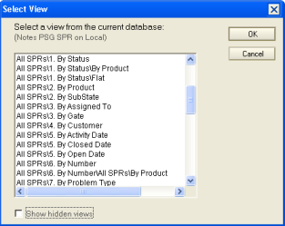

# Overview

It may be important to associate your changes to elements to issues in your issue tracking database. When you check in or out an element you can note the issue you were working on.

## To select issues by view
You can select a view for displaying issues as follows:

1. On the **Issues** tab of the CIAO! Configuration page, select an **Issue Database Server**.
2. Click the **Select by View** radio button.  
   You see the **Issue View** field and the **Select View** button.  
   
3. Click the **Select View** button.  
   You see the **Select View** window.  
   
4. Select the view you want for displaying issues.  
   

     
Note

     
The first two columns of the view must be of type text. The first column is for the issue number and the second column is for the issue description.

   

5. Click **OK**.

## To select issues by formula
If the issue tracking database is very large or does not have a view relevant to your work, you can use a formula to determine issues to select from.

1. From the **Issues** tab of the CIAO! Configuration page, click the **Select by Formula** radio button.  
2. In the Issue Formula field, enter a Notes selection formula. The following is an example of an issue selection formula:  
   <table><tr><th>Formula Example</th><td>If you have a field called Assignee in your issue tracking database, you might only want to display issues that relate to the current user working on the current application. The following formula will do this: Product="app.ntf"|@username=AssignedTo Note: This assumes that your issue db contains a field called "Product" which contains the application file name and a field called "AssignedTo" which contains a canonical username.</td></tr></table>
3. In the **Issue Number** field, enter the name of the field (in the issue tracking database) that identifies the issue.  
   This sets the field populating the Issue Selection window which you see when you are assigning check-ins and check-outs to issues. This field must be data type text.
4. In the **Issue Description** field, enter the name of the field (in the issue tracking database) that provides a description of the issue.  
   This sets the field populating the Issue Selection window which you see when you are assigning check-ins and check-outs to issues. This field must be data type text. 