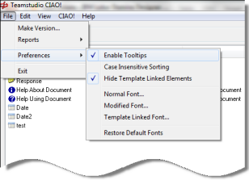
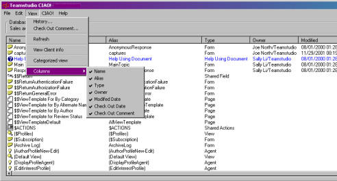
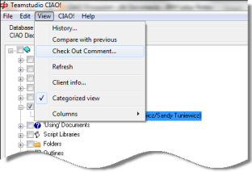

# CIAO! のプリファレンスとビューの変更
CIAO! メインウィンドウでは、CIAO! の表示方法を好みに合わせて設定す ることができます。ビューの表示方法を変更することもできます。

## CIAO! のプリファレンスの変更
次のプリファレンスを変更できます。

* ツールヒントの表示/非表示
* 大文字と小文字を区別しない並べ替えの有効化/無効化(有効にすると大文字/ 小文字が無視されます)
* テンプレートにリンクする要素の表示/非表示
* 標準要素と変更要素のフォント定義
* テンプレートにリンクする要素のフォント定義
* デフォルトフォントへ戻す
<figure markdown="1">
  
</figure>

### ツールヒントを表示/非表示にするには
次の手順でツールヒントを表示/非表示にできます。

* CIAO! メニューから、[ ツールヒントを表示 ] を選択してメニュー項目のチェッ クマークをオン/オフにします。

### 大文字と小文字を区別しない並べ替えを有効/無効にするには
次の手順で大文字と小文字を区別しない並べ替えを有効/無効にできます。

* CIAO! メニューから、**[ 大文字/小文字を区別しない並べ替え ]** を選択してメ ニュー項目のチェックマークをオン/オフにします。

### テンプレートにリンクする要素を非表示にするには
テンプレートにリンクする要素に変更を加えた場合、設計が更新または置換された変更を後で上書きできます。CIAO! のプリファレンスを変更して、テンプレートにリンクする要素が CIAO! ウィンドウに表示されないようにすることができます。 

* **[ ファイル ] > [ プリファレンス ] > [ テンプレートにリンクする要素を非表示 ]** をクリックします。

### フォントを定義するには
次の手順で、CIAO! ウィンドウで使用されるフォントの種類を定義できま す(標準要素のフォントなど)

1. **[ ファイル ] > [ プリファレンス ] > [ 標準要素のフォント ]** をクリックします。  
   **[ フォント ]** ウィンドウが表示されます。
2. 必要に応じて、フォント、フォントのスタイル、サイズ、効果、色を選択します。
3. **[OK]** をクリックします。

### Toデフォルトフォントを復元するには
次の手順でデフォルトフォントを復元できます。

* **[ ファイル ] > [ プリファレンス ] > [ デフォルトフォントへ戻す ]** をクリックし ます。

## ビューでの変更
ビューでは、次のような変更を加えることができます。  

* ビューの列の追加または削除
* カテゴリ別表示の変更

### ビューの列を追加または削除するには
次の手順で、CIAO! ウィンドウに表示する列を選択できます。 

1. **[ 表示 ] > [ 列 ]** をクリックしてオプションで列をビューに追加し、表示される情報のタイプをカスタマイズします。
2. 項目のチェックボックスをオン/オフにして、ビューに列を追加または削除します。
   

### カテゴリ別表示を変更するには
CIAO! メインウィンドウのデフォルトビューでは、列の見出しをクリックして並べ替えることができます。さらに、CIAO! には、次の手順で切り替え可能な設計要素のカテゴリ別ビューもあります。 

* 2 つの表示を切り替えるには、**[ 表示 ] > [ カテゴリ別表示 ]** をクリックします。  
  

[ カテゴリ別表示 ] の横のチェックマークは、カテゴリ別表示がオンになっていることを示しています。