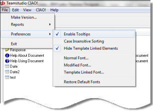

# Changing CIAO! Preferences and Views

From the main CIAO! window, you can set preferences for how you want CIAO! to appear. You can also make changes to how the views appear.

## Changing CIAO! Preferences
You can change the following preferences:

* Enable or disable Tooltips
* Enable or disable case insensitive sorting (when enabled, sort ignores case)
* Hide or show template linked elements
* Define the fonts for normal and modified elements
* Define the font for template-linked elements
* Restore the default font
<figure markdown="1">
  
</figure>

### To enable/disable Tooltips
You can enable or disable tooltips as follows:

* From the CIAO! menu select **Enable Tooltips** to add or remove the checkmark from the menu item.

### To enable/disable case insensitive sorting
You can enable or disable case insensitive sorting as follows:

* From the CIAO! menu select **Case Insensitive Sorting** to add or remove the checkmark from the menu item.

### To hide template-linked elements
If you make changes to template-linked elements, the changes could later be overwritten in the case of a design refresh or replace. You can change CIAO! preferences so that template-linked elements are not displayed in the CIAO! window.

* Click **File > Preferences > Hide Template Linked Elements**

### To define fonts
You can define font types, for example, the Normal Font, used in the CIAO! window as follows:

1. Click **File > Preferences > Normal Font**  
   You see the **Font** window.
2. Select the font, font style, size, effects and color as needed.
3. Click **OK**.

### To restore the default font
You can restore the default font as follows:

* Click **File > Preferences > Restore Default Fonts**

## Making changes in the view
Here are some changes you can make to the view: 

* Add or remove columns from the view
* Change to a categorized view

### To add/remove columns from the view
You can choose which columns to display in the CIAO! window as follows:

1. Click **View > Columns** to add optional columns to the view, customizing the type of information that appears.
2. Check or uncheck an item to add or remove the column from the view.
   

### To change to a categorized view
The CIAO! main window *default* view lets you sort by clicking a column heading. CIAO! also has a *categorized* view of design elements that you can switch to as follows:

* Click **View > Categorized View** to toggle between the two views.  
  

The check mark beside Categorized View indicates that the Categorized View is active. 