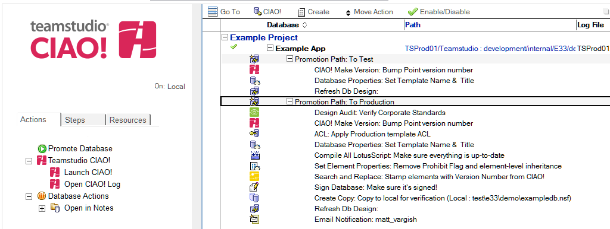
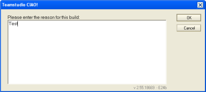
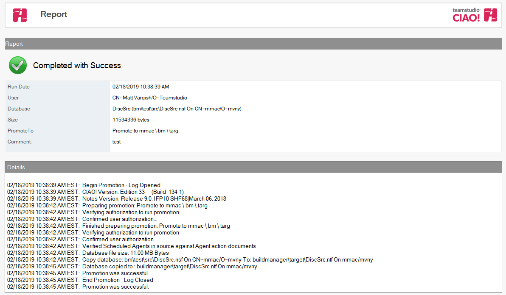

# データベースの昇格
データベースのリリース番号を変更して、開発サイクルの次の段階に移行するには、データベースを昇格します。管理者が昇格手順を作成すると、次の手順でデータベースを昇格できます。

## データベースを昇格するには
1. CIAO! 設定データベースを開きます。
2. 昇格するデータベースを検索して選択します。
3. **[ データベースを昇格する ]** をクリックします。  
   
4. **[ コメント ]** ウィンドウが表示されます。 プロモーションのコメントを入力し、**[OK]**をクリックします。  
     
   プロモーションが完了すると、プロモションのレポートが表示されます。レポートにはプロモーションが成功したか否かと、プロモーション中に記録されたログを含んでいます。  
   
 
プロモーションのレポートは CIAO! 設定データベースに保存され、ログのビューで確認することができます。プロモーションの実行方法に関する詳細情報や複数のプロモーションを起動させる方法など[プロモーションの実行](promotionrunning.md)を参照してください。