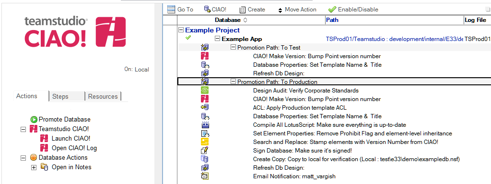
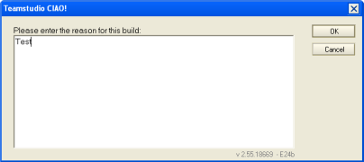
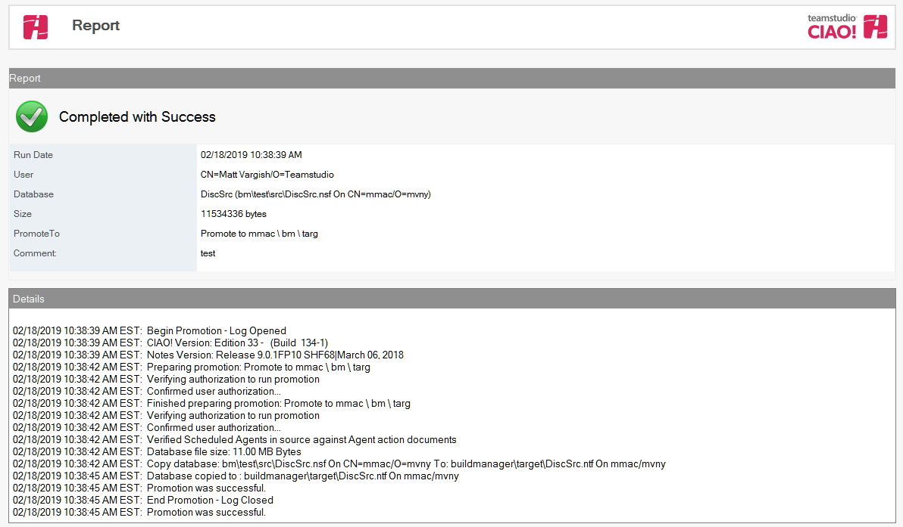

# Promoting a Database

You promote a database to change its release number and move it to the next phase of the development cycle, for example, deploying a template to a Dev, Test or Production server. [Promotion Paths](promotionpaths.md) are defined in the CIAO! Configuration database to specify the server and path of the new database.

CIAO! can perform a number of steps during a promotion to ensure the new template is properly signed and configured for the new environment. For more information, see [Build Steps](buildsteps.md).

Once an admin has created the promotion steps, you can promote a database as follows:

## To promote a database
1. Open the CIAO! Config database.
2. Locate the database you want to promote and select the Promotion Path to run.
3. Click **Promote Database**.  
   
4. If a comment is required, the Comment window will be displayed. Enter a comment for the promotion and click OK.  
     
   When the promotion is complete, the **Promotion Report** will be displayed. The report indicates whether the promotion succeeded, and includes the log recorded during the promotion:  
   
 
Promotion Reports are saved within the CIAO! configuration database, and can be found in the **Logs** view.

For more information about how promotions run, and options to invoke multiple promotions at once, see [Running Promotions](promotionrunning.md).