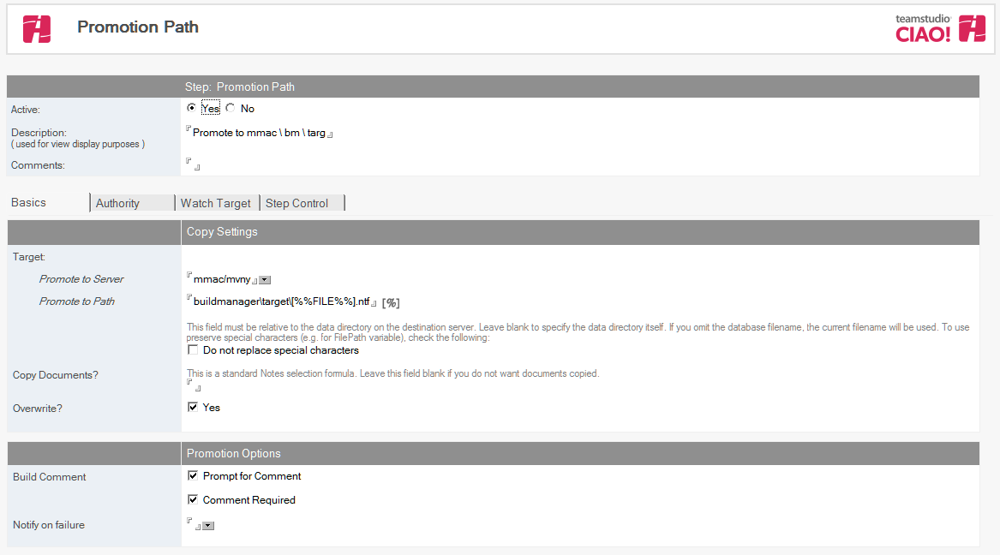

# プロモーションパスの構築
プロモーションパスでは、プロモーションされるでアプリケーションテンプレートのサーバーとパスを指定します。プロモーションパス文書を設定するには、 プロモーションパスを作成して名前を付け、コピー設定を入力して、プロモーショ ンオプションを選択します。ビルドステップはプロモーションの実行パスの子文書として作成し、ビルドステップに追加していき有効化します。

## プロモーションパスを作成して名前を付けるには
1. CIAO! 設定データベースから、プロモーションパスを作成するデータベース文書を選択します。
2. **[ 作成 ]** メニューから、**[ プロモーションパス ]** をクリックします。  
   [ プロモーションパス ] 文書が表示されます。  
   
3. **[ アクティブ ]** フィールドの横の **[ はい ]** がまだ選択されていない場合は、選択します。
4. **[ 説明 ]** フィールドに、プロモーションパスを説明する名前を入力します (「Dev>QA」など)。  
   このフィールドを空白にすることはできず、一意の名前を入力する必要があり ます。 

## プロモーションパスのコピー設定を構築するには
以下のようにプロモーションパスのコピー設定を構築してください:

1. プロモーションパス文書から、**[基本]**タブをクリックします。 
2. **サーバーへ昇格フ**ィールドにデータベースをプロモーションしたいサーバーを選択します。このフィールドにブランクは許されていません。
3. **パスへ昇格 フ**ィールドで、データベースをプロモーションしたいパスを入力します。このフィールドはターゲットのサーバー上のデータディレクトリーからの相対パスで指定します。データディレクトリー直下に配置したい場合にはこのフィールドはブランクにしてください。データベース名を指定しない場合には、現在の名前が使用されます。  
   ページの上部にある青いパーセント記号(%)は、そのフィールドで置換マクロを使用できることを示します。青いパーセント記号をクリックすると、すべてのオプションが表示されます。ページの上部にある灰色のパーセント記号は、選択されたフィールドでマクロを使用できないことを示します。
4. データベースまたはテンプレートと一緒に移動する必要がある文書がある場合は、**[ 文書をコピーしますか ?]** フィールドにノーツ選択式(SELECT @ALL など)を入力します。
5. 昇格するファイルの古いコピーを上書きするには、**[上書きしますか?]**フィールドをオンにしてください。  
   

     
Note>

     
この設定をオフにすると、ターゲットデータベースがすでに存在する場合、昇格が失敗します。

   

   
## Toプロモーションできるユーザーを制限する場合
**権限** タブでプロモーションを実行を許可するユーザーをリストすることができます。

## プロモーションパスのプロモーションオプションを設定するには
次の手順で、プロモーションパスのプロモーションオプションを設定します。

1. データベースを昇格して昇格時に[プロモーションコメント]ウィンドウすることをユーザーに要求するには、[ コメントのプロンプトを表示 ] フィールドをオンにしてください。 
2. **[ エラーを通知 ]** フィールドで、昇格が失敗したときに E メールを送信するユーザーを 1 つ以上のアドレス帳から選択します。  
   昇格を行ったユーザー([ 昇格 ] ボタンをクリックしたユーザー)には、昇格処理の最後にステータスウィンドウで通知が行われます。
 
## プロモーションでリリースされたターゲットの NTF に対して CIAO! の監視オプションを設定する方法
CIAO! では、プロモーションが行われたターゲットに対して CIAO! での監視を有効にできるよう設定できます:

1. プロモーションパス文書からターゲットの監視タブをクリックします。
2. ターゲットのデータベースを監視するには、**新規データベースを監視しますか？**のフィールドに「はい」を選択します。
3. 昇格先設定データベースのサーバーのフィールドに設定データベースの選択ボタンか入力をして設定データベースのあるサーバーを指定します。
4. 昇格先設定データベースのパスのフィールドには、プロモーションしたテンプレートを監視したいデータベースの設定データベースを選択ボタンか入力をしてパスを指定します。
5. 昇格先ログデータベースのサーバーのフィールドには、プロモーションしたデータベースに対して使用するログデータベースのあるサーバー名を選択ボタンか入力をして指定します。
6. 昇格先ログデータベースのパスのフィールドには、プロモーションしたデータベースに対して使用するログデータベースのパスを選択ボタンか入力をして指定します。
7. この文書を保存して閉じてください。
