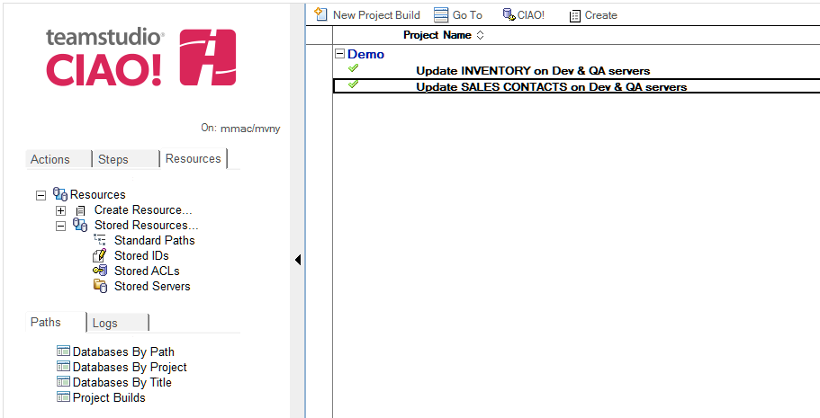
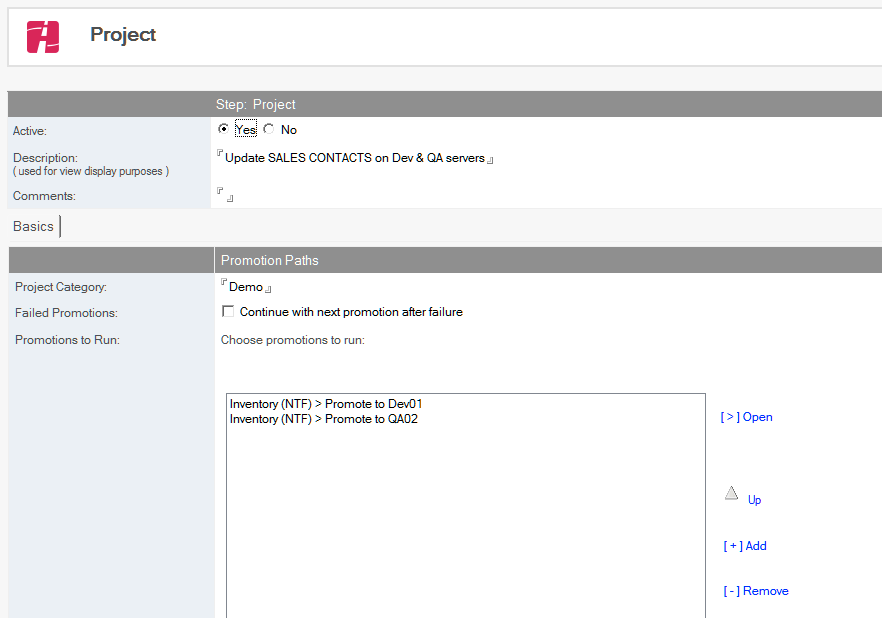
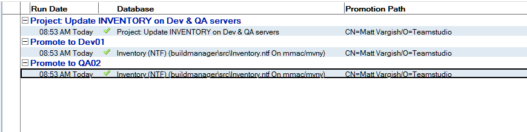

# プロジェクトビルド

プロジェクトビルドで複数の[プロモーションパス](promotionpaths.md)を指定し、ワンクリックで指定した順序で実行させることができます。

プロジェクトビルドを作成するには、パス > プロジェクトビルド ビューに移動します:
<figure markdown="1">
  
</figure>
新規プロジェクトビルドをクリックしてプロジェクトビルドを作成します:
<figure markdown="1">
  
</figure>
 
**説明**フィールドに入力したのち、追加ボタンでプロジェクトビルドに含めるプロモーションパスを指定します。起動するプロモーションパスの順番を編集することもできます。任意で、失敗後に次のプロモーションを続行するを選択し、前のプロモーションが失敗しても次のプロモーションを実行するようにできます。最後にこのプロジェクトビルドを保存します。
 
プロジェクトビルドを実行するにはプロジェクトビルドのビュー内で対象を選択しデータベースを昇格ボタンをクリックします。プロモーションは指定した順番に実行されます。プロジェクトビルド全体のrログが作成されるとともに個別のプロモーションパスに対するログも作成され、それぞれログのビューで確認することができます:
<figure markdown="1">
  
</figure>
 