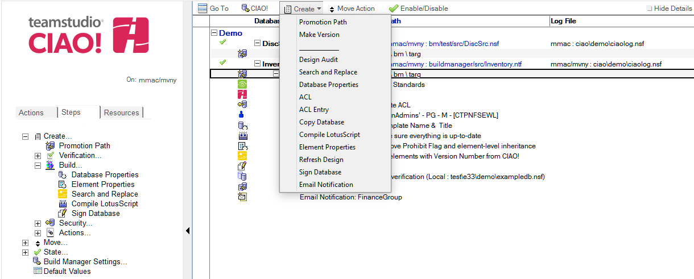

# プロモーションパスの使い方
CIAO のプロモーション機能を使用すると、別の段階に(通常は、開発段階から、1 つ以上のテスト段階を経て、プロダクション(本番稼動)段階に)データベース設計のバージョンを昇格するプロセスを定義できます。

1. CIAO! 設定データベースを開きます。
2. プロモーションパスのビューからビルドステップを追加するプロモーションパス文書を選択します。  
   
3. **[ 作成 ]** メニューから、作成したいビルドステップを選択します。
4. **[アクティブ]** フィールドで、[はい] がまだ選択されていない場合は選択します。
5. **[ 説明 ]** フィールドに、ステップを説明する名前を入力します。この値はビューに表示されます。
6. ステップごとにある残りのフィールドに適切な内容を入力してください。個々のステップに関する詳細の情報は[ビルドステップ](buildsteps.md)を参照してください。