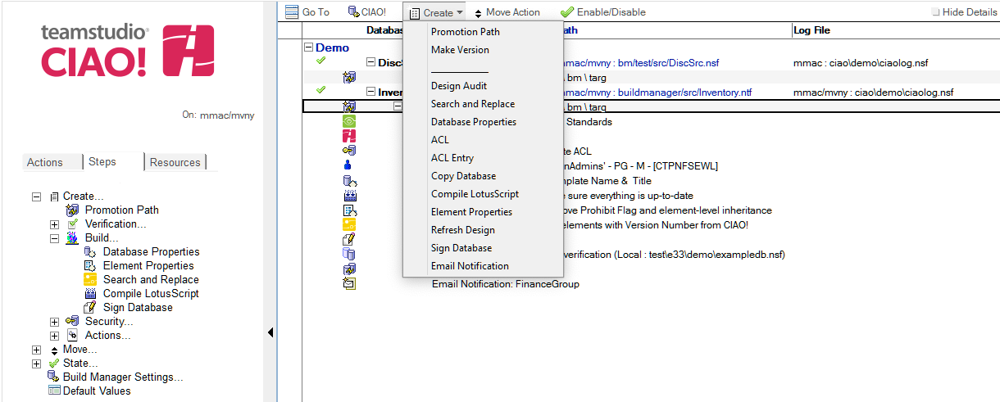

# Working with Promotion Paths

Using CIAO's Promotion feature, you can define a process for promoting versions of your database design from one stage of usage to another, typically, from the development stage, through one or more testing stages and then into production.

1. Open the CIAO! Config database.
2. Select the Promotion path document to which you want to add Build Steps in one of the Promotion Path views:  
   
3. From the **Create** menu, choose the type of build step to create.
4. For the **Active** field, select Yes to enable the step.
5. In the **Description** field, enter a meaningful description of the step. This value will be displayed in the view.
6. Complete the remainder of the fields on the step as appropriate. For more information on individual steps, see [Build Steps](buildsteps.md).