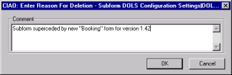
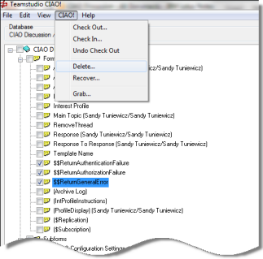

# 要素の削除および復元
チェックアウトした設計要素のみ、監視下のデータベースから削除できま す。チェックアウトした要素をデータベース設計から削除すると、データ ベース設計に変更を加えたときと同様に、コメントの入力が求められます。
<figure markdown="1">
  
</figure>

同時に複数の要素を削除する場合は、要素ごとにコメントを入力するため、 作業が面倒になる場合があります。

## CIAO! から複数の要素を削除するには
1. 削除する要素を選択します。
2. 選択した要素すべてをチェックアウトします。
3. **[CIAO!]** メニューから、**[ 削除 ]** を選択します。  
     
   設計要素を削除すると、CIAO! メインウィンドウには表示されなくなり ます。 

## 削除した設計要素を復元するには
削除した設計要素は、次の手順で復元できます。

1. **[CIAO!]** メニューから、**[ 復元 ]** を選択します。  
   **[ 復元 ]** ウィンドウが表示され、削除された設計要素すべてが表示されます。
2. **[ アイテム ]** 列で、要素名をクリックします。
3. **[ ロールバック ]** ボタンをクリックします。  
   ロールバックが完了すると、要素が自動的にチェックアウトされます。
   
!!! note
    復元操作を行う際に、Designer でデータベース設計を開いていると、データ ベースを閉じて、もう一度開くまで、設計のビューの更新が行われません。復 元操作を行った後は、作業を続ける前に、必ずノーツのデータベース設計を 閉じてから再度開いてください。F9 キーを押すと、ノーツのユーザーイン ターフェイスを更新できます。