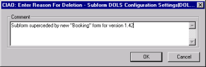
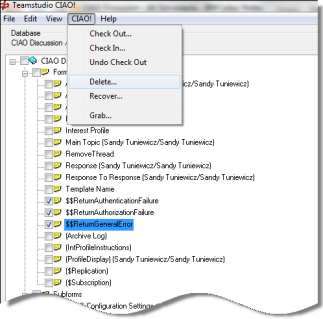

# Deleting and Recovering Elements

You can only delete a design element from a watched database if you have the element checked out. If you have an element checked out, and you delete it from the database design, CIAO! asks you for a comment, as it would for any other change to the database design.
<figure markdown="1">
  
</figure>

If you are deleting a number of elements at the same time, it can become tedious to enter the same comment for each element.

## To delete multiple elements through CIAO!
1. Select the elements you want to delete.
2. Check them all out.
3. From the **CIAO!** menu, choose **Delete**.  
     
   Once you delete a design element, you no longer see it in the CIAO! main window. 

## To restore a design element that was deleted
You can restore a deleted design element as follows:

1. From the **CIAO!** menu, select **Recover**.  
   You see the Recover window, showing all the design elements that have been deleted.
2. In the **Item** column, click the element name.
3. Click the **Rollback** button.  
   Once the rollback is complete, the element is automatically checked out to you.
   
!!! note
    If the database design is open in Designer when you do the Recover operation, Notes does not refresh the view of the design until you close and re-open the database. After a Recover operation, always close the database design in Notes and open it again before continuing. Press **F9** to refresh the Notes user interface.