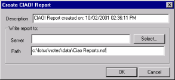
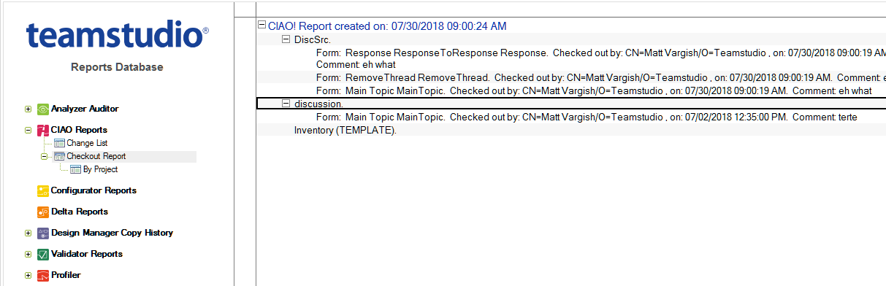

# チェックアウトアクティビティレポート
現在チェックアウトされている要素の一覧を表示するには、チェックアウ トアクティビティレポートを実行します。このレポートには、CIAO! の監 視下に置かれているすべてのデータベースの要素が含まれています。

実行時のチェックアウトアクティビティが記録されるため、過去のレポー トデータも次回の実行の際に引き継いで保存して、チェックアウトの履歴 を維持することができます。

## チェックアウトレポートを作成するには
1. **[ ファイル ]** メニューから、**[ レポート ] > [ チェックアウトレポートの作成 ]** を選択します。  
     
   レポートには、CIAO! 設定データベースの一覧に含まれているすべての データベースが含まれています。  
   **[CIAO! レポートの作成 ]** ウィンドウが開き、デフォルトのタイトルと現在の日 時が表示されます。**[ 説明 ]** ボックスのテキストを変更して、レポート名を変更 することもできます。  
     
   レポートデータベースがない場合は、CIAO! により自動的に作成されます。
2. **[OK]** をクリックして、レポートを作成します。  
   レポートの場所を示すメッセージが表示されます。 
 
## チェックアウトレポートを表示するには
1. CIAO! レポートデータベースを開きます。
2. [CIAO! チェックアウトレポート ] ビューを開きます。  
   デフォルトで、ビューはデータベース名順に並べ替えられて表示されていま す。プロジェクト名、およびデータベース名で並べ替えることもできます。  
     
   各設計要素に関する次の情報が表示されます。
    * アイテムのタイプ
    * 設計要素の名前
    * 要素をチェックアウトした開発者名
    * チェックアウトの日時
    * 開発者のコメント(該当する場合)
 