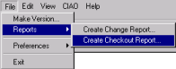
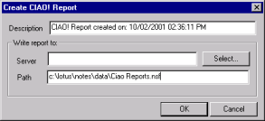
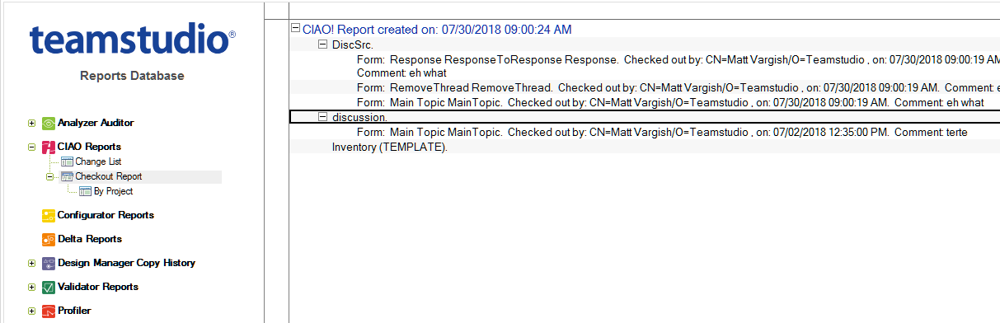

# Checkout Activity Report

You run the Checkout Activity Report to see a list of what elements are currently checked out. The report includes elements from all the databases watched by CIAO!. 

Since this report shows check-out activity at the time it is run, you can save previous report data from one run to the next so you have a history of check-out activity.

## To create a Checkout Report
1. From the File menu, choose **Reports > Create Checkout Report**.  
     
   All databases listed in the CIAO! Config database are included in the report.  
   You see the **Create CIAO! Report** window with a default title and the current date and time. You can change the report name by changing the text in the **Description** box.  
     
   If you do not have a report database, CIAO! creates one.
2. To create the report, click **OK**.  
   You see a message with the report's location. 
 
## To view the checkout report
1. Open the CIAO! Report database.
2. Open the CIAO! Checkout Report view.  
   The view is sorted by database name (by default). An alternate view is sorted by project and database name.  
     
   You see the following information for each design element:
    * Item Type
    * Name of the design element
    * Developer who checked out the element
    * Date and time of the check-out
    * Comment that the developer included (if any)
 