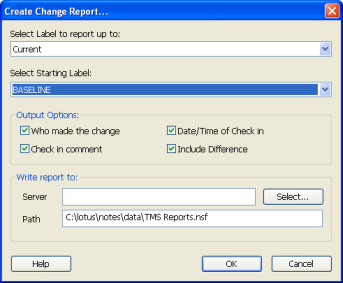
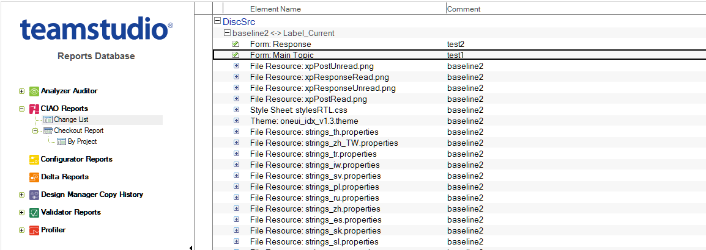
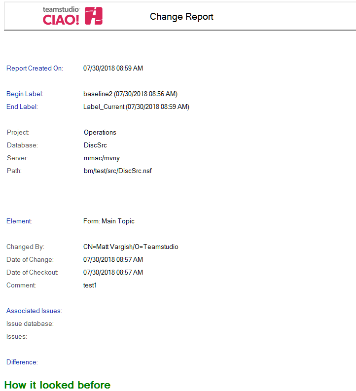

# 変更レポート
データベースバージョン間で変更された要素のみ表示するには、CIAO! の 変更レポートを表示します。変更レポートの情報は、リリースノートのソー スとして使用できます。

## 特定のデータベースの変更レポートを作成するには
1. 最新の変更を変更レポートに含めたい場合は、データベースの新しいバージョ ンを作成します。
2. **[ ファイル ]** メニューから、**[ レポート ] > [ 変更レポートの作成 ]** を選択します。 **[ 変更レポートの作成 ]** ウィンドウが表示されます。  
   
3. 必要なバージョンの範囲を選択します。
    1. レポート範囲の終了バージョンラベルを選択します。
    2. 変更のレポート範囲の開始ラベルを選択します。
4. レポートの列として使用する出力オプションを選択します。
    * 変更を行ったユーザー
    * チェックインの日時
    * チェックインコメント
    * 相違点
    
続いて次に以下を行います。

1. オプションとして、レポートの出力先サーバーおよびパスを指定するか、デ フォルトを使用します。
2. [OK] をクリックして、レポートを作成します。  
   レポートが正常に作成されたことを示すメッセージが表示されます。

## 変更レポートを表示するには
1. レポートデータベースを開きます。
2. プラス記号をクリックしてCIAOレポートセクションを展開し、[変更リスト] をクリックします。
3. 表示する変更の横の三角を開きます。  
   
4. 任意の要素をダブルクリックし、その詳細な変更レポートを表示します。  
   
