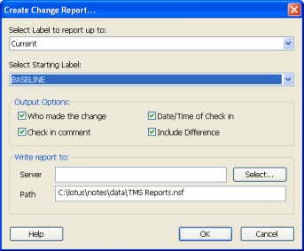

# Change Report

To see only those elements that have changed between database versions, view the CIAO! Change Report. You can use information in the change report as a source for release notes.

## To create a change report for a specified database
1. Make a new version of the database if you want the ability to include its most recent changes in the change report.
2. From the **File** menu, choose **Reports > Create Change Report**. You see the **Create Change Report** window.  
   
3. Select the range of versions you want.
    1. Select the version label to report up to.
    2. Select the starting label to report changes from.
4. Select the output options to use as the report columns.
    * Who made the change
    * Date/Time of Check in
    * Check in comment
    * Include Difference
    
Next you will then:

1. Optionally identify the server and path of the report's output location, or use the default.
2. Click **OK** to create the report.  
   You see a message telling you the report has been successfully created.

## To view the Change Report
1. Open the reports database.
2. Expand the CIAO Reports section by clicking the plus sign, then click Change List.
3. Open the twistie for the changes you want to see.
   
4. Double-click any element to see a detailed change report for it.  
   
