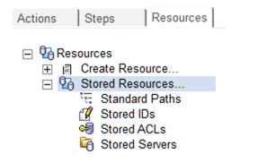

# 紹介

Teamstudio CIAO! の管理機能を使用すると、ビルドプロセスの自動化に役立つ 格納 ID、格納 ACL、および格納サーバー名、標準パスを作成できます。この機能は新しいプロモ－ションとビルドパスの作成を容易にします。 さらに作成されたビルドとプロモーションパスのデータの一貫性を確認することに役立ちます。

格納リソースを探すには、CIAO! 設定データベースを開きます。ログインユーザーが適切なACLのロールを持っていることを確認してください。 左側パネルに[基本]、[管理]、[リソース]の3つのタブがあります。 リソースを選択すると以下のような展開出来るメニューが表示されます:
<figure markdown="1">
  
</figure>