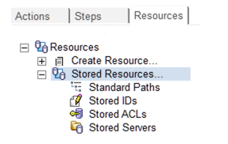

# Overview

Using Teamstudio CIAO! Administration functions, you can create Stored IDs, Stored ACLs, Stored Server Names and Standard Paths to help automate your build process. These features make it much easier to create new Promotion and Build Paths. In addition, it helps to ensure the consistency of the Build and Promotion Paths that are created.

To find the stored resources simply open your CIAO! configuration database. Ensure you have appropriate ACL roles, and you will see 3 tabs within the left-hand panel:  Actions, Steps, and Resources. When you select resources you should see the expandable menu as per the figure below:
<figure markdown="1">
  
</figure>