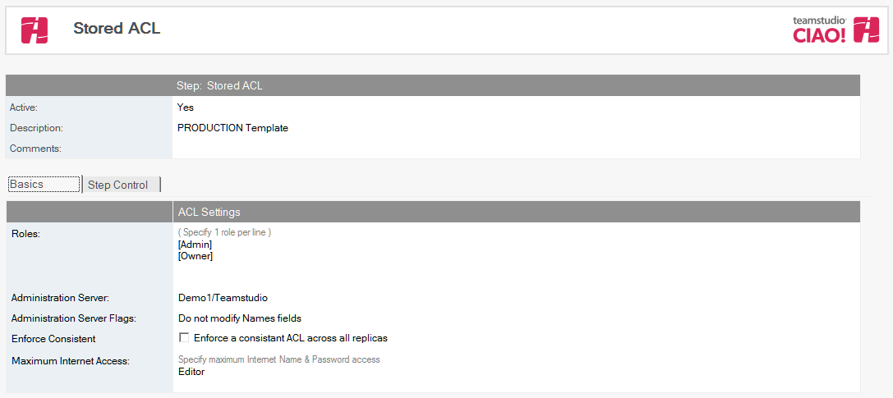

# Stored ACLs

To make the build process more consistent, you can refer to a stored ACL. These ACLs can then be imported into any Promotion Path in a database or a Standard Path. Stored ACLs may either be created manually or by importing an ACL from an existing database.

## To create a stored ACL:
1. From the Resources tab, select Resources > Stored ACLs.
2. Click the Create Stored ACL action button on the toolbar. The Stored ACL File dialog box appears.
3. Active is set by default. Do not change this.
4. Enter a description (for example, Production Template Access).
5. If appropriate, specify any roles, one per line.
6. Click the dropdown beside the Administration Server name field, and select a server name from the dialog box. N.B the list of servers presented is derived from the list of Stored Servers
7. Set Enforce Consistent if appropriate.
8. Click the dropdown beside the Maximum Internet and password field and select a role from the dialog box.
9. Save & exit.
<figure markdown="1">
   
</figure>
