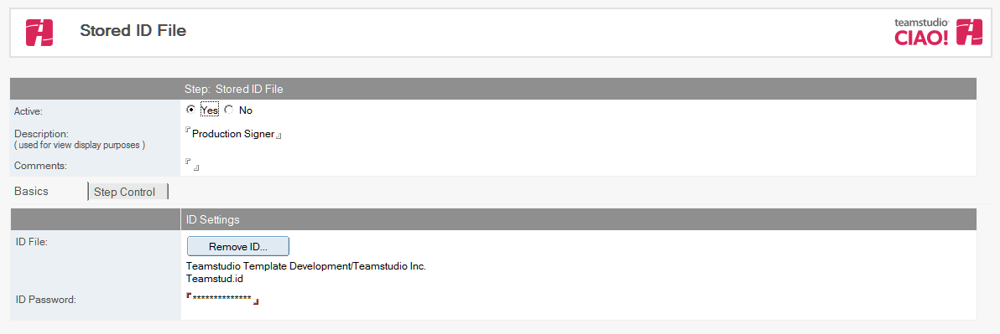

# 格納 ID

格納 ID は CIAO! の中にIDファイルとそのパスワードを保存することが出来ます。これはCIAO! 管理者（定期的にプロモーションパスを作成する人）に実際のIDファイルまたはパスワードへのアクセス権限を与えることなくIDファイルを使ったプロモーションパスの作成を有効にします。 復数のIDとパスワードはそれぞれの異なったタスクで使われる CIAO! 内に格納されます。（例） データベースの署名、もしくはプロモーションの実行。
<figure markdown="1">
  
</figure>

## 格納 ID を作成するには:
1. リソースタブから[リソース] - [リソースの作成] - [格納 IDの作成] を選択します。
2. デフォルトにより [ 状態] が設定されています。これは変更しないでください。
3. 説明（「本番DB署名用ID」など）を入力します。 
4. ID の目的を記述したコメントを追加します。
5. [ID の選択] ボタンをクリックし、既存の IDファイルを選択します。 
6. ID ファイルのパスワードを [ID パスワード] フィールドに入力します。
7. 終了して保存します。
<figure markdown="1">
  
</figure>
