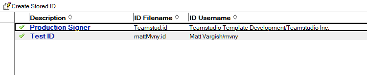
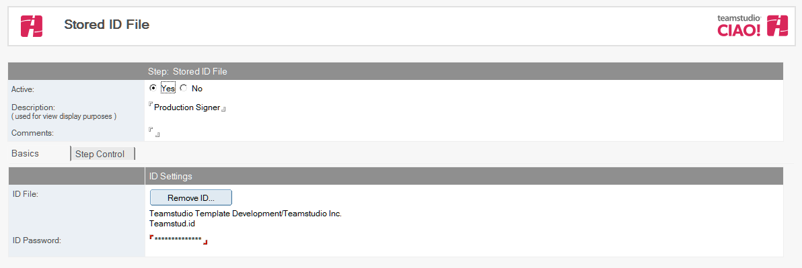

# Stored IDs

The Stored IDs feature allows the saving of an ID file - together with its password - inside CIAO!. This enables the CIAO! Administrator (the person who will be creating Promotion Paths on a regular bases) to create Promotion Paths which utilize the ID without actually granting them access to the actual ID file or its password. Multiple IDs and their passwords may be stored in CIAO! each used for a different task e.g. signing a database or performing a promotion.
<figure markdown="1">
  
</figure>

## To create a Stored ID:
1. From the Resources tab, select Resources - Create Resource – Create Stored ID.
2. Active is set by default. Do not change this.
3. Enter a description (for example, Signing Production DBs ID).
4. Add a comment to describe the purpose of the ID.
5. Click the Select ID button and browse to an ID file.
6. Enter the password for the ID file into the ID Password field.
7. Save and close. 
<figure markdown="1">
  
</figure>
