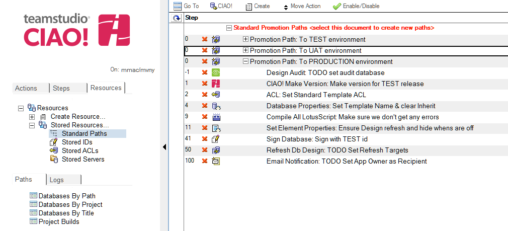

# 標準パス

標準パスはほとんどのデータベースで使う一般的なステップを保存するのに使われる便利なテンプレートです。もし大部分を占めるアプリケーションがプロモーションのため同じ自動化されたステップを通りそれぞれの環境へ処理されるということであれば、標準パスは一度設定するだけで復数の必要なデータベースに適応することができます。 これはそれぞれのデータベースがビルドとプロモーションパスのため似たような自動化された処理を設定する際に時間の短縮になります。
<figure markdown="1">
  
</figure>

## 標準パスを作成するには:  
1. リソースタブから[格納リソース] - [標準パス] を選択します。
2. ビューの最初の文書を選択し[作成] > [プロモーションパス] をクリックします。 
3. 自動化されたステップが設定されたデータベースのプロモーションパスをセットアップします。  
   注記: ステップが一つの特定のデータベースを指定しないようにするためにマクロ言語を使います。
4. I各パスのため全てのステップを選択し無効にすることをお勧めします。 これは標準パスを利用するとき管理者にとって可視できるガイドになります。一度データベースへ適用したら、参照されるデータベースの下でステップが有効になる前に、管理者はそれぞれのパスが適合しているかレビューし、必要であれば更に詳細の設定をステップに対して行うことができます。  
   注記: もし一度適応されたデータベースにステップが必要ない場合、データベースのプロモーションパスの下のステップを削除することが出来ます。これは標準パスに保存されているステップや順番に影響しません。
5. データベースへ標準パスを適用するために設定文書を選択し、**CIAO! - 標準パスのコピー**をクリックします。