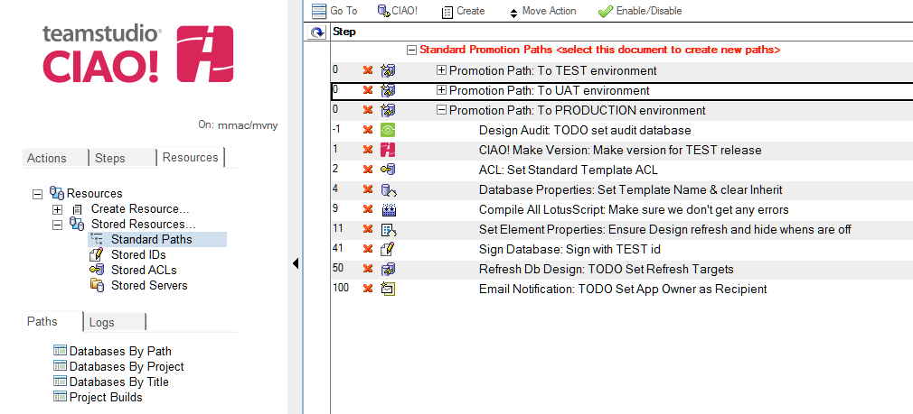

# Standard Paths

Standard Paths are a convenient template used to store common steps for use with most databases. If a large percentage of your applications go through the same automated steps for promotions to each environment the steps can be stored here as a one-time configuration and then applied to each database where necessary. This saves time manually configuring each database with similar automated activities for each Build or Promotion Path.
<figure markdown="1">
  
</figure>

## To create a Standard Path: 
1. From the Resources tab, select Stored Resources - Standard Paths
2. Select the first document in the view then click **Create > Promotion Path**.
3. Set up the Promotion Path as you would for a database with the automated steps configured.  
   **Note**: Use the macro language where possible so steps are not specific to one particular database.
4. It is recommended that you select all the steps for each path and disable them. This is a visual guide for administrators when using Standard Paths. Once applied to a database the Administrator can then review each path for applicability and further configure the step if required before enabling the step under the database referenced.   
   **Note**: If any step is not needed once applied to the database you can delete the step under the Promotion Path of the Database. This does not affect the steps or order stored in the Standard Path.
5. To apply a Standard Path to a database, select the configuration document then click **CIAO! - Copy Standard Path** 