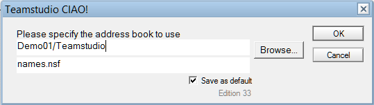

# 格納サーバー

データベースの昇格先のサーバーをリストに含める必要があります。格納サーバー文書に、これらの各サーバーを昇格できる人をあらかじめ定義することもできます。このようにしてサーバーのアクセス権限をアクションの作成権限と区別すると、セキュリティが向上します。 

格納サーバーは手動もしくはDomino®ディレクトリからインポートして指定されます。 

## サーバーをインポートするには:
1. リソースタブから[リソース] - [格納サーバー] を選択します。
2. [サーバーをインポート] アクションボタンをクリックします。 
3. [参照] をクリックし、使用するアドレス帳を指定します。  
   
4. [OK] をクリックします。
5. Dominoディレクトリ内にリストされている各サーバーが格納サーバー文書を持ちます。
6. 有効なターゲット出ないサーバーを削除します。
7. 下記のように各格納サーバー文書を編集します:
    1. [昇格権限リスト] フィールドの横にあるドロップダウンをクリックし、昇格権限を持つ 1 人以上のユーザーまたは 1 つ以上のグループ、あるいはその両方を選択します。 
    2. このサーバーのプロモーションパスを作成するとき、このフィールドに一覧表示される名前は、そのプロモーションパスに許可される唯一のユーザーになります。
    3. [更新を許可するサーバー] フィールドの横にあるドロップダウンをクリックし、参照できるサーバーまたは [ すべて] を選択します。指定したサーバーに昇格するとき、一覧表示されているサーバーは、データベースを更新できる唯一のサーバーになります。 
 
## サーバーを追加するには:
1. リソースタブから[リソース] - [格納サーバー] を選択します。
2. 右側のペインで、[サーバーを追加] アクションボタンをクリックします。
3. 文書の[状態] フィールドは、デフォルトにより有効になっています。この設定は変更しないでください。
4. 説明（「本番」など）を入力します。
5. サーバー名の必要なアクションの作成時にBuild Managerのキーワードリストに表示されるサーバー名（「PROD01」など）を入力します。  
   注記: ローカルのワークステーションへの昇格を許可するには、サーバー名に「local」と入力します。 
6. [昇格権限リスト] フィールドの横にあるドロップダウンをクリックし、昇格権限を持つ 1 人以上のユーザーまたは 1 つ以上のグループ、あるいはその両方を選択します。このサーバーのプロモーションパスを作成するとき、このフィールドに一覧表示される名前は、そのプロモーションパスに許可される唯一のユーザーになります。
7. [ 更新を許可するサーバー] フィールドの横にあるドロップダウンをクリックし、参照できるサーバーまたは [ すべて] を選択します。指定したサーバーに昇格するとき、一覧表示されているサーバーは、データベースを更新できる唯一のサーバーになります。 
8. 終了して保存します。
<figure markdown="1">
  
</figure>

## 格納サーバーアクションの検証
プロモーションで必要となるすべてのサーバーが定義され有効になっているかを確認するには、アクション > 管理 > 格納サーバーの検証 を実行します。このエージェントは、プロモーションパスと設計更新ステップをスキャンし、格納サーバー定義がないサーバーや無効になっているサーバーの名前を表示します。サーバー名を選択して格納サーバー定義を自動的に作成し有効化できます。

このアクションで作成した格納サーバーは、サーバー名と説明フィールドの両方に対してサーバー名が使用されます。更新を許可するサーバーのフィールドにはブランクのままで同一サーバー上のデータベースのみ更新を許可します。 