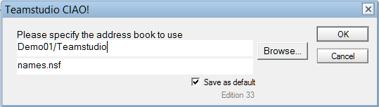
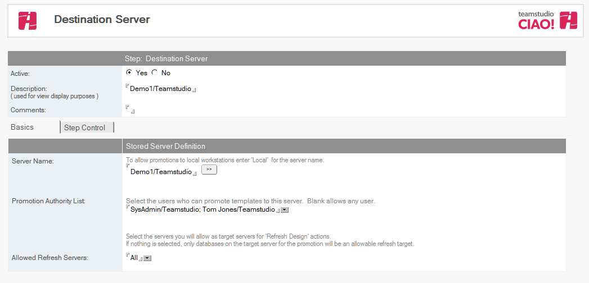

# Stored Servers

You must define a list of servers to which you want to promote databases. From a stored server document you can also predefine who can promote to each of those servers. This improves security by separating server access authority from the authority to create an action.

Stored servers may either be specified manually or imported from the Domino® Directory

## To Import Servers
1. From the Resources tab, choose Resources > Stored Servers.
2. Click the Import Servers action button.
3. Click Browse and specify the address book to use.  
   
4. Click OK.
5. Each server listed in the Domino Directory will have a Stored Server document.
6. Delete any servers which are not valid targets
7. Modify each of the Stored Server documents as follows:
    1. Click the dropdown beside the Promotion Authority List field and select one or more users and/or groups who have the authority to promote to this server. 
    2. When creating promotion paths to this server, any names listed in this field become the only allowed users of that promotion path.
    3. Click the dropdown beside the Allowed Refresh Servers field and select a server that can be refreshed or All When promoting to the specified server, the servers listed are the only servers allowed to refresh databases.
 
## To Add a Server
1. From the Resources tab, choose Resources > Stored Servers.
2. In the right pane, click the **Add Server** action button.
3. The document is Active by default. Leave this setting.
4. Enter a description (for example, **Production**).
5. Enter the server name (for example, **PROD01**) that appears in CIAO! keyword list when you are creating an action that requires a server name.  
   **Note**: To allow promotions to local workstations, enter local for the server name. 
6. Click the dropdown beside the Promotion Authority List field and select one or more users and/or groups who have the authority to promote to this server. When creating promotion paths to this server, any names listed in this field become the only allowed users of that promotion path.
7. Click the dropdown beside the Allowed Refresh Servers field and select a server that can be refreshed or All When promoting to the specified server, the servers listed are the only servers allowed to refresh databases.
8. Save and exit
<figure markdown="1">
  
</figure>

## The Verify Stored Servers action
To ensure that all the servers required for **Promotions** are defined and enabled, run **Actions > Admin > Verify Stored Servers**. This agent launches a wizard to scan **Promotion Paths** and **Design Refresh** steps, and display the names of server that have missing or disabled **Stored Server** definitions. Server names can be selected to automatically create or enable **Stored Server** documents.

**Stored Servers** created by this action will use the server name for both the **Server Name** and **Description** field. No **Promotion Authority** entries will be added, allowing any user to promote to this server. The **Allowed Refresh Servers** field will be left blank, allowing refresh of databases only on the same server.  