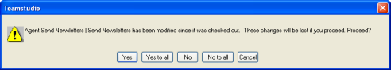

# チェックアウトの取り消し

設計要素を変更した後で、変更を取り消す場合は、CIAO! で該当する要素 を選択して、[CIAO!] メニューから [ チェックアウトの取り消し ] を選択し ます。最後のチェックイン以降で要素に行われた変更が CIAO! により検出 されると、次のメッセージが表示されます。
<figure markdown="1">
  
</figure>

**[ いいえ ]** をクリックすると、チェックアウトの取り消しがキャンセルされ、 要素はチェックアウトされたままになります。

**[ はい ]** をクリックすると、要素がチェックアウト前の状態に復元されます。 チェックアウト以降、設計要素に行った変更は失われます。

**[ キャンセル ]** をクリックした場合の結果は、**[ すべて維持 ]** をクリックした 場合と同じです。