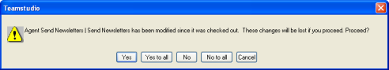

# Undoing a Check Out

If you have changed a design element, but change your mind, you can undo any changes you made by selecting the element in CIAO! and choosing **Undo Check Out** from the **CIAO!** menu. If CIAO! detects that you made changes to the element since the last check-in, you see the following message.
<figure markdown="1">
  
</figure>

If you click **No**, the Undo Check-out operation will be canceled, and the element will remain checked out to you.

If you click **Yes**, the element will be restored to its state before the check-out. Any changes made to the design element after it was checked out are lost.

If you click **Cancel**, it is the same as if you clicked **No to All**.