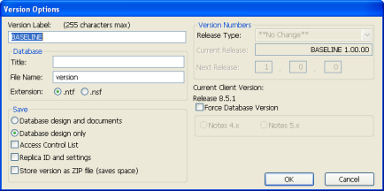

# 紹介

CIAO! を使用するには、まず監視下に置くデータベースを指定します。 

CIAO! では、認識しているデータベースの一覧がその設定データベース (CIAO 設定データベース)内に保持されます。監視するデータベースを指定する前に、その設定データベースがどこにあるかを CIAO! で指定する必要があります。

!!! note
    CIAO! を初めて実行すると、CIAO! ライセンスの取得時に、入手したシリ アル番号とキーを入力する画面が表示されます。この情報を入力してい ない場合は、アプリケーションデータベースのバージョンコントロール を有効にする前に、必ず入力してください。  
    詳しくは インストールガイド を参照してこの手続きを完了してから次に進んでください。

## CIAO! を起動してデータベースを CIAO! の監視下に置くには
1. Designer で、データベースを開きます。
2. ツールバーの[CIAO!]ボタンをクリックします。  
   CIAO! が CIAO! 設定データベースを検出できない場合、設定データベースの場 所を編集するかどうかを確認するメッセージが表示されます。
3. **[はい]**をクリックして**[TeamstudioCIAO!クライアント情報]**ウィンドウを作 成します。
4. **[ データベースが常駐するサーバーの CIAO! 設定を使用する ]** オプションをク リックして選択すると、ターゲットデータベースのサーバー上の CIAO! 設定 データベースが強制的に使用されます。  
   これが機能するためには、この設定データベースが監視下のデータベース と同じサーバーに存在し、CIAO\CIAOConfig.nsf とする必要があります。  
   
   データベースを監視するように CIAO! が設定されていないことを示し、監視下 のデータベースのリストに一覧に追加するかどうかを確認するメッセージが 表示されます。
5. **[ はい ]** をクリックし、監視下にあるデータベースの一覧にこのデータベースを 追加します。  
   **[ 設定情報の入力 ]** ウィンドウが表示されます。  
     
   次の表では、設定フィールドについて説明します。  
   <table><tr><th>フィールド</th><th>説明</td></tr>
     <tr><td>データベース</td><td>監視するデータベースのタイトル。デフォルト情報は、ワークス ペースで選択したデータベースアイコンに基づいています。</td></tr>
     <tr><td>プロジェクト</td><td>作業をプロジェクトとして設定できます。各プロジェクトにはいく つかのデータベースが含まれます。以前にプロジェクトを定義して いる場合は、このフィールドのドロップダウンメニューにそのプロ ジェクト名が表示されます。このフィールドにプロジェクト名を入 力して、新しいプロジェクトを作成することもできます。</td></tr>
     <tr><td>ログファイル(データベース)</td><td>ログデータベースのサーバーとパスを入力するか、[選択]をクリッ クして、ログデータベースを指定します。デフォルトで、最後に選 択したログデータベースのサーバーおよびパスがこのフィールド に入力されます。指定したサーバーとパスに対応するログデータ ベースがない場合は、新しいログデータベースが作成されます。</td></tr>
   </table>
6. 設定情報を入力し、[OK]をクリックします。[ バージョンコメントの入力 ] ウィンドウが表示されます。  
   
7. コメント(たとえば、「CIAO! の監視下にある初回バージョン」など)を入力 し、[OK] をクリックします。 [ バージョン オプション ] ウィンドウが表示されます。  
     
   **[キャンセル ]** をクリックすると、データベースは、ベースラインバージョ ンなしで CAIO! の監視下に置かれます。データベースが CIAO! 監視下に置 かれなくなるわけではなりません。
8. [ バージョンラベル ] フィールドに初回バージョン(または 01000T などの任意 の名前)を入力し(デフォルトは「BASELINE」)、**[OK]** をクリックします。  
   [ バージョンラベル ] フィールドには、文字と数字のみ入力できます。  
   フィールド設定に関する詳細については、[バージョンオプションについて](versionoptions.md) を参照してください。
