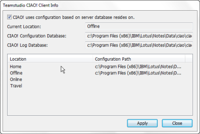
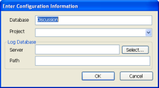
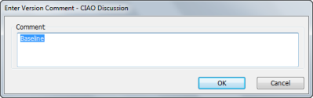
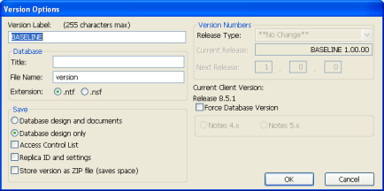

# Overview

To use CIAO!, you first identify a database to put under control.

CIAO! keeps a list of the databases it knows about in its configuration database, the CIAO Config database. You need to tell CIAO! where its configuration database is before you tell it what databases to watch.

!!! note
    The first time you run CIAO!, you are prompted for the serial number and key pair you got with your CIAO! license. If you have not entered this information, you must do so before you can enable version control for your application database.  
    See the Teamstudio Installation Guide, to complete this step before continuing. 

## To start CIAO! and put a database under CIAO! control
1. In Designer, open the database.
2. Click the CIAO! button on the toolbar.  
   If CIAO! cannot find the CIAO! Config database, you see a message asking if you want to edit the location of the configuration database.
3. Click **Yes** to display the **Teamstudio CIAO! Client Info** window.
4. Click to select the **CIAO! uses configuration based on server database resides on** option to force CIAO! to use the CIAO! Configuration database on the server of the target database.  
   This configuration database must be on the same server as the watched database and be called CIAO\CIAOConfig.nsf.  
   
   You see a message telling you that CIAO! is not configured to watch the database and asking if you want to add it to the list of watched databases.
5. Click **Yes** to add this database to the list of watched databases. You see the **Enter Configuration Information** window.  
     
   The following table describes the configuration fields.  
   <table><tr><th>Field</th><th>Description</td></tr>
     <tr><td>Database</td><td>The title of the database to watch. The default information is based on the database icon you selected on the workspace.</td></tr>
     <tr><td>Project</td><td>You can organize your work into projects. Each project has a set of databases within it. If you have previously defined any projects, they appear in the drop-down menu in this field. You can create a new project by typing the project name into this field.</td></tr>
     <tr><td>Log File (database)</td><td>You can enter the server and path for the log database if you know them. Or click Select to browse for a log database. The value in this field will default to the last log database you selected. CIAO! can create a new Log database, if one does not exist for the specified server and path.</td></tr>
   </table>
6. Enter the configuration information and click **OK**. You see the **Enter Version Comment** window.  
   
7. Enter a comment, for example, "Initial version under CIAO! control" and click **OK**.  
   You see the **Version Options** window.   
     
   Clicking Cancel puts the database under CAIO! control without a baseline version. It does not cancel putting the database under CIAO! control.
8. Enter **Initial** (or a name of your choice, such as 01000T) into the **Version Label** field (the default is BASELINE) and click **OK**.  
   You can enter only letters and/or numerals in the Version Label field.  
   See [Version Options](versionoptions.md), for more information on field settings.
