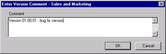

# バージョンの作成と過去バージョンへの復元
誤って変更したり、適切なテストなしでプロダクション(本番稼動)段階 に移行した場合、最後の変更セットを取り消して、機能するデータベース 設計にすぐに戻すことができます。前回のバージョンが作成されたときか らデータベースに加えられた多数の変更を戻す必要がある場合は、データ ベース設計全体を復元できます。

データベース設計の変更が終了し、データベースの新しいリリースを作成 する準備ができたら、新しいバージョンを保存してすべての設計要素に割 り当て、一度に同じコメントを付けることができます。その後、要素に加 えた変更の履歴を参照し、特定のリリースの前後でどのような変更が行わ れたかを確認することができます。

さらに、このタイミングでデータベース設計のバージョン番号を繰り上げ ます。

データベースをCIAO!の監視下に最初に置く際に、CIAO!はそのデータベース の初回バージョンを自動的に作成します。

CIAO! 設定データベースを使用して、バージョン作成機能へのアクセスを制限できます。詳細については、[CIAO! の機能へのアクセス権の割り当て](featureaccess.md)を参照してください。 

データベースのバージョンを作成すると、QA またはプロダクション(本番稼動)段階に移行可能なポイントリリースを作成できます。または、必要なときに安定したロールバックポイントを作成しておくこともできます。

バージョンは次のように作成できます。 
## データベース設計のバージョンを作成するには
1. Designer で、作業するデータベースを開きます。
2. ツールバーの[CIAO!]ボタンをクリックします。
3. すべての設計要素をチェックインします。
4. CIAO! の **[ ファイル ]** メニューから、**[ バージョン作成 ]** を選択します。 **[ バージョンコメントの入力 ]** ウィンドウが表示されます。
5. バージョンの目的を記述したコメントを入力します。  
     
   **[ バージョン オプション ]** ウィンドウが表示されます。
6. 必要なバージョンオプションをクリックして**[OK]**をクリックします。詳細については[ バージョンオプションについて](versionoptions.md) を参照してください。  
   新しいバージョンラベルのエントリが各設計要素の履歴に追加されます。