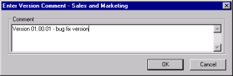

# Making Versions and Restoring to Previous Versions

If changes are made accidentally or have been put into production without proper testing, you can undo the last set of changes and return quickly to a database design that works. If you need to reverse a large number of changes that have been made to the database since the last version was made, you may want to restore the entire database design.

When your team has finished making changes to a database design, and you are ready to make a new release of the database, you can save and assign a new version to all of the design elements giving them the same comment at the same time. Then you can look at the history of changes made to any one element and see which changes were made before a particular release was made, and which changes were made after the release.

This is also the time when you increment the version number of your database design.

When you first put a database under CIAO! control, CIAO! automatically tries to make an initial version of that database.

You can restrict access to the Make Version feature through the CIAO! Configuration database. See [Assigning CIAO! Feature Access](featureaccess.md), for more information.

You make a version of a database design so you can have a point release ready for QA or for Production, or just a stable roll-back point when you need it. 

## To make a version of a database design
1. In Designer, open the database you want to work with.
2. Click the CIAO! button on the toolbar.
3. Check in all design elements.
4. From the CIAO! **File** menu, choose **Make Version**. You see the **Enter Version Comment** window.
5. Enter a version comment describing the purpose of the version.  
     
   You see the **Version Options** window.
6. Select the version options you want, and then click **OK**. See [Understanding Version Options](versionoptions.md), for more information.  
   CIAO! adds the new version label entry to the history of each design element. 