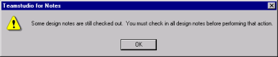

# Version Options

The following tables describe the sections of the **Version Options** window:

## Version Options: Version Label and Database
| Item | Description |
| --- | --- |
| Version Label | No spaces or special characters are allowed except "\_" (underscore). Enter the label, which will become part of the version name. For example, entering Sales for version number 1.1.0 results in a release number of Sales1.1.0. This is a required field. |
| Title | The database title for the new version |
| File Name | The filename for the new version. |
| Extension | NTF for template or NSF for database. |

## Version Options: Save
| Item | Description |
| --- | --- |
| Database design and documents | Select this option to store the data that is in the database along with its design. This may be useful if you want to keep test data with this version of the database, or if some data documents, such as configuration documents, form part of the design. The default, Database design only, stores only the design, without the data. |
| Database design only | Select this option to store only the database design. |
| Access Control List | Select this check box to have CIAO! maintain the access control list for the saved database. Otherwise, the default access (author) is applied. |
| Replica ID and settings | Select this check box to have CIAO! keep any replication settings you have configured. |
| Store version as ZIP file | Select this check box to store the version CIAO! creates in a compressed format in the CIAO! Log to save space. If this check box is cleared, CIAO! creates your database version as an .nsf or .ntf file, uncompressed. |

## Version Options: Version Numbers
| Item | Description |
| --- | --- |
| Release Type | Choose the type of release: No Change (to define a baseline or initial value for a design), Major, Minor or Point. Consider the three place version numbering scheme (1.0.0).<ul><li>The left-most position indicates a major version to accommodate major feature additions</li><li>The middle position indicates a minor version to accommodate minor feature enhancements</li><li>The right-most position indicates a point version for bug fixes</li></ul>You can customize the terms used for the Release Type options in CIAO! Config. |
| Current Release | This is the current release number. CIAO! looks to see if previous versions exist in the Log database. If previous versions exist, CIAO! uses the latest for the current version number. If no previous version is found, CIAO! uses the default value from the CIAO! Config document. You cannot change this field. |
| Next Release | This is the next release number, a field you can change. It was recorded in the CIAO! Log as the latest release number. For the first version number assignment by CIAO!, you can start from the beginning (for example, 1.0.0), or you can use the database's current version number (for example, 3.4.0). If no previous version is found, CIAO! uses the default value from the CIAO! Config document. |
| Current Client Version | Version of Notes Designer |
| Force Database Version | Select this check box to choose a Notes release that is earlier than your current client version. This option makes the new version of your database compatible with this release. |

If you try to make a version while a design element is still checked out, you see a message telling you to check in all design notes. Notes that are checked out tell you that a developer may not have finished that work.
<figure markdown="1">
  
</figure>

Once you check in all design notes, select **Make Version** again.

When you make a version, and CIAO! cannot find a check-in document in the Log database, CIAO! creates one. The reason for this is so you can roll-back to the version of the design element as it was when that version was created. You cannot perform a roll-back operation on a version record. CIAO! gives this check-in operation the same comment given to the version to show that the only purpose of the check-in is to create the version.

!!! note
    If you receive the error message "You are not authorized to perform that action" while creating a new version of the database design, this is probably caused by a private view or agent in the database design that belongs to someone else. Be sure you have rights to all the elements in the database before you make a version.