# データベース設計全体の復元
個々の設計要素の変更のロールバックを行えるだけでなく、データベース の過去バージョン全体をバージョン作成が実行された時点に戻すこともで きます。

データベース設計全体を復元するには、新しいバージョンを作成し、CIAO! ログファイルから復元後のバージョンを取得し、そのバージョンを上書き するデータベースのパスに保存します。 

## データベース設計全体をロールバックするには
データベースは、次の手順で復元できます。

1. CIAO! 設定データベースを開きます。  
   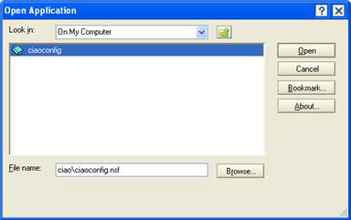
2. ロールバックする設計が存在するデータベースのデータベース文書を見つけ ます。
3. データベース文書を選択します。次に、TeamstudioCIAO!の**[アクション]**セクションで、**[CIAO! ログを開く ]** をクリックします。  
   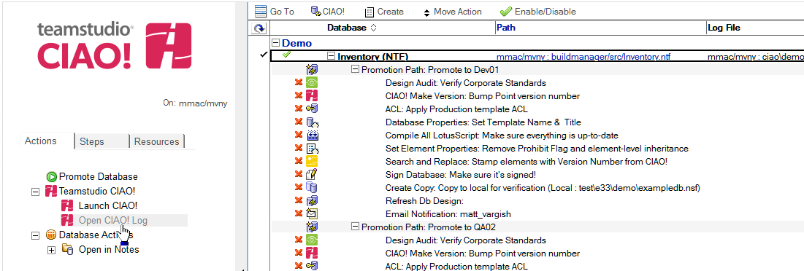
4. ログデータベースが開いたら、[バージョン]ビューを選択します。次に、ロー ルバックする設計が存在するデータベースのバージョンのデータベース文書を見つけて開きます。  
   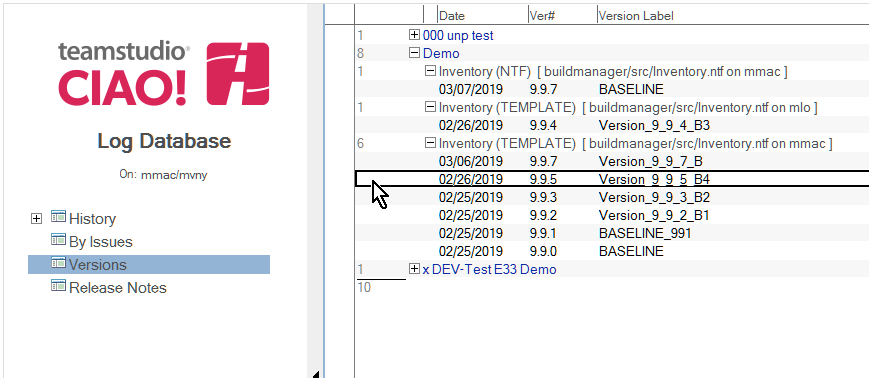
5. バージョンの添付ファイルを検索します(ntfまたはzipファイル形式)。  
   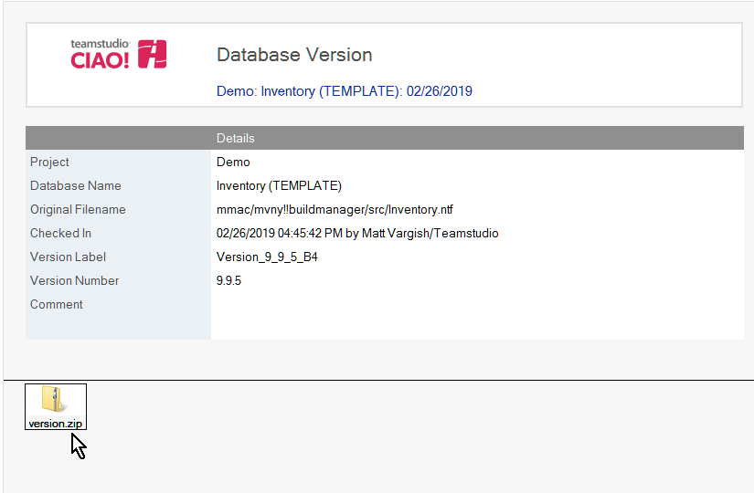
6. ntf の場合、右クリックして添付ファイルをローカルデータディレクトリに保存 します。zip の場合、ローカルデータディレクトリに展開します。
7. [ ファイル ] > [ 開く ] > [Lotus Notes アプリケーション ] をクリックし、[ ファイ ル名 ] ボックスに「version.ntf」と入力します。  
   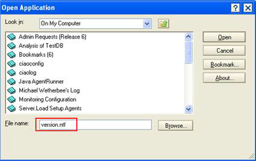
8. データベースが開いたら、[ファイル]>[アプリケーション]>[プロパティ] を選択することで、アプリケーションのプロパティを開きます。  
   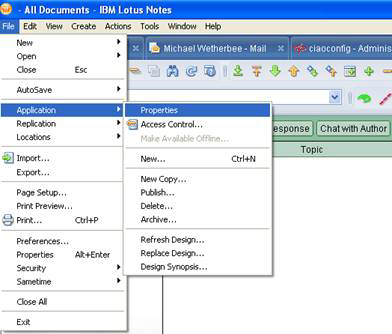
9. プロパティボックスが開いたら、[設計]タブをクリックします。  
   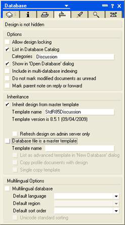
10. テンプレートに一意のテンプレート名を付けます(たとえば、「version」という語の後に日時を付けます)。  
   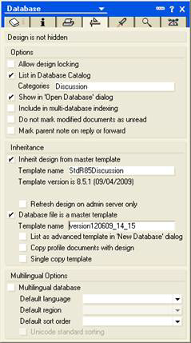
11. このバージョンをテンプレートとして確立したら、CIAO!でロールバックする データベースを開きます。次に、すべての設計要素をチェックアウトします。  
   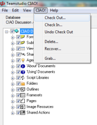
12. Designerで、ロールバックするデータベースを開きます。次に、設計を置換し ます。  
   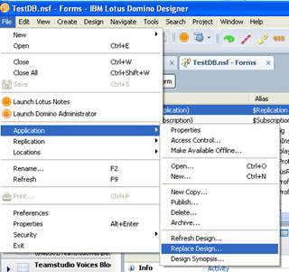  
   テンプレート選択ウィンドウが表示されます。
13. version.ntfテンプレートを選択して、[置換]をクリックします。  
   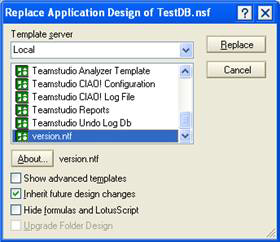
14. 置換が完了したら、Teamstudio CIAO! でロールバックしたデータベースを開きます。次に、変更された項目(青のフォント)をチェックインします。  
   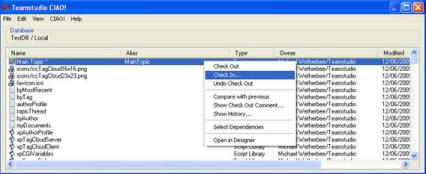
15. 残りの項目を選択します。次に、チェックアウトを取り消します。  
   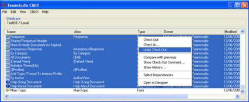
   
データベースは過去バージョンへ正常にロールバックされています。
