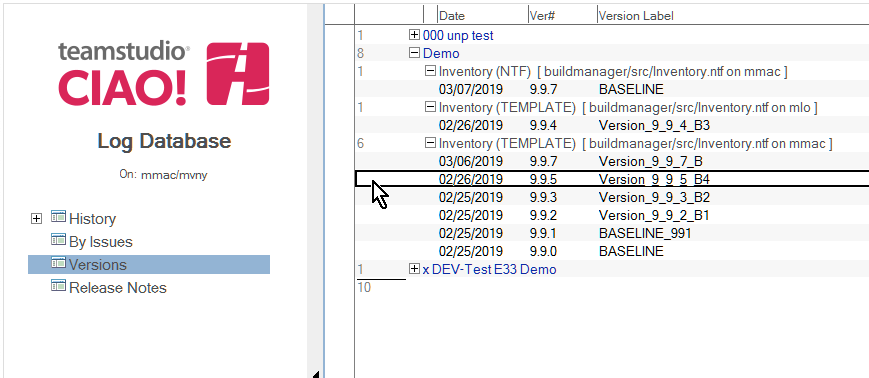
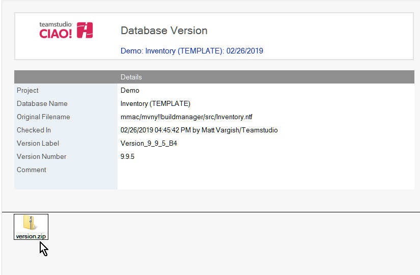
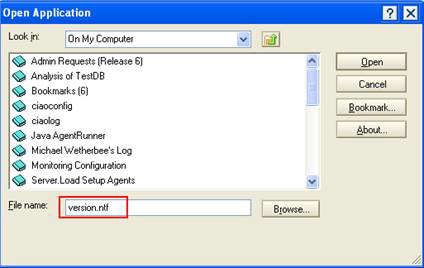
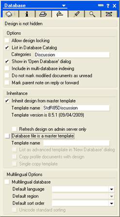
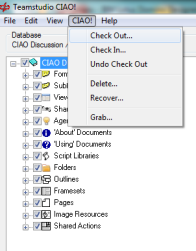
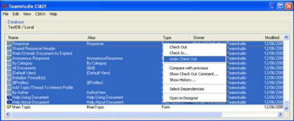

# Restoring the Entire Database Design

In addition to being able to roll back individual design element changes, you can also revert to a complete previous version of the database, that is, to a point at which a Make Version was performed.

To restore the entire database design, you make a new version, get the version you want to bring back from the CIAO! log file and save the version to the path of the database you want to overwrite. 

## To roll back the entire database design
You restore a database design as follows:

1. Open the CIAO! Configuration database, which you typically find in the ciao/ciaoconfig.nsf path.  
   
2. Locate the database document for the database you want to roll the design back on.
3. Select the database document. Then, in the Teamstudio CIAO! > Actions section, click Open CIAO! Log.  
   
4. Once the log database opens, select the Versions view. Then locate and open the version document for the version of the database you want to roll back the design of.  
   
5. Locate the version attachment, which can be in the ntf or zip file format.  
   
6. For an ntf, right click and save the attachment to your local data directory. For a zip, extract it to your local data directory.
7. Click File>Open>Lotus Notes Application and type version.ntf in the File name box.
   
8. Once the database opens, open the application's properties by selecting File > Application > Properties.  
   
9. When the properties box opens, click the Design tab.  
   
10. Give the template a unique template name, for example, the word "version" followed by the date and time.  
   
11. Once you have established this version as a template, open the database you want to roll back in CIAO!. Then, check out all design elements.  
   
12. In Designer, open the database you want to roll back. Then replace the design.  
     
   You see the template selection window.
13. Select the version.ntf template and click replace.  
   
14. Once the replace is complete, open the database you rolled back in Teamstudio CIAO!. Then check in the changed items (blue font).  
   
15. Select the remaining items. Then undo the checkout.  
   
   
The database has been successfully rolled back to a previous version. 
