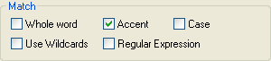

# 濁点/半濁点を区別した検索

<figure markdown="1">
  
</figure>

**[ 濁点/半濁点を区別 ]** チェックボックスをオンにすると、濁点および半濁点が区別されます。たとえば、「ば」「ぱ」「は」を含む場合は、それぞれ別の文字列と見なされます。

たとえば、[濁点/半濁点を区別]チェックボックスをオフにして、「Naïve」 という文字列を「Innocent」という文字列で置換すると、次のような結果になります。
<table>
  <tr><td>"Naïve"</td><td>という文字列は置換後</td><td>"Innocent"</td><td>となります。</td></tr>
  <tr><td>"Naive"</td><td>という文字列は置換後</td><td>"Innocent"</td><td>となります。</td></tr>
</table>

With the **Accent** check box selected, the same search/replace operation would have the following results:
<table>
  <tr><td>"Naïve"</td><td>という文字列は置換後</td><td>"Innocent"</td><td>となります。</td></tr>
  <tr><td>"Naive"</td><td>という文字列は置換されず</td><td>"Naive"</td><td>のままになります。</td></tr>
</table>
