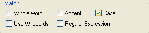

# 大文字と小文字を区別した検索

<figure markdown="1">
  
</figure>

**[ 大文字と小文字を区別 ]** チェックボックスをオンにすると、両文字列の活字の大きさが一致する場合のみ、置換が行われます。日本語の場合は、さらに全角と半角の区別、またはひらがなとカタカナの区別を行います。

たとえば、**[ 大文字と小文字を区別 ]** チェックボックスをオフにして、「Customer」という文字列を「Client」という文字列で置換すると、次のような結果になります。

<table>
  <tr><td>"Customer"</td><td>という文字列は置換後</td><td>"Client"</td><td>となります。</td></tr>
  <tr><td>"customer"</td><td>という文字列は置換後</td><td>"Client"</td><td>となります。</td></tr>
</table>

With the **Case** check box selected, the same search/replace operation would have the following results:
<table>
  <tr><td>"Customer"</td><td>という文字列は置換後</td><td>"Client"</td><td>となります。</td></tr>
  <tr><td>"customer"</td><td>という文字列は置換されず</td><td>"customer"</td><td>のままになります。</td></tr>
</table>
