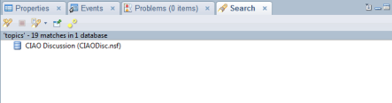
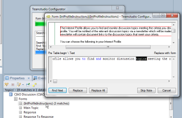
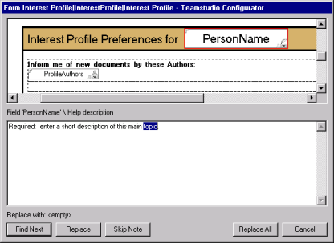
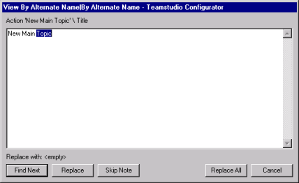
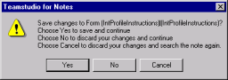

# Configurator により一致が検出された場合
Configurator を Designer の [ 検索 ] メニューから使用した場合は、検索結果のサマリがウィンドウ最下部の [ 検索 ] タブに表示されます。
<figure markdown="1">
  
</figure>

一致した項目まで順に表示し、そこで Configurator の動作を決定することができます。
<figure markdown="1">
  
</figure>

Configurator が一致を検出した場合に表示される情報は、要素の種類によって異なります。プリビューペインを使用可能な領域(ビジュアル要素やスタティックテキストなど)に一致がある場合、一致を強調表示した分割ウィンドウが表示されます。
<figure markdown="1">
  
</figure>

単純なテキストおよびコードの一致の場合、次のように一致したテキストがコンテキストで表示されます。
<figure markdown="1">
  
</figure>

ウィンドウタイトルには、一致が見つかったノートの名前が反映されます。

このウィンドウから次のことを実行できます。

* **[ 次を検索 ]** ボタンをクリックすると、次の一致文字列が検索されます。同じダイアログボックス内で次の文字列が検出される場合もあります。
* **[ 置換 ]** ボタンをクリックすると、強調表示された一致テキストが置換され、次の一致文字列が検索されます。
* **[ 次の要素へ ]** ボタンをクリックすると、次の要素またはドキュメントに移動します(表示されている文字列に変更を
* **[ すべて置換 ]** ボタンをクリックすると、現在の選択項目が置換され、自動的にデータベース内の他の一致文字列もすべて置換されます。
* **[ キャンセル ]** ボタンをクリックすると、検索が中止されます。
 
!!! note
    ビュー名を手動で変更するには、強調表示された領域を編集し、**[ 次を検索 ]** をクリックします。
 
フォーム、サブフォーム、またはデータベースの使い方やデータベースについてのヘルプ文書にあるスタティックテキストで文字列が一致すると、ウィンドウの上半分にはフォーム、またはサブフォームの一致テキストがコンテキストと共に表示され、下半分にはテキストの編集可能なバージョンが表示されます。
<figure markdown="1">
  
</figure>

**[ 置換 ]** ボタンをクリックし、強調表示されたテキストを置換して、次の一致文字列を検索することができます。あるいは、ウィンドウの下半分に表示されたテキストを手動で編集し、**[ 次を検索 ]** をクリックすることもできます。

!!! note
    変更を加えて **[ 次の要素へ ]** をクリックすると、処理中の要素に加えた変更を保存するかどうか、またはアクションをキャンセルするかどうか選択するプロンプトが表示されます。**[ キャンセル ]** をクリックして取り消されるのは、次の要素へ移動する操作のみです。さらに一致文字列がある場合、処理は継続されます。
 
特定の設計要素で一致する文字列がすべて検索されると(**[ 次の要素へ ]** をクリックして、処理を中止していない場合)、継続する前に、この要素に置換機能や手動で加えた変更を保存するかどうかを確認する画面が表示されます。
<figure markdown="1">
  
</figure>

次のいずれかをクリックします。

| 選択 | アクション |
| --- | --- |
| はい | 設計要素内で加えた変更を保存して、次の一致文字列を検索します。 |
| いいえ | 設計要素に加えた変更を保存しないで、次の一致文字列を検索します。 |
| キャンセル | 設計要素に加えた変更を保存せずに、同じ要素を最初からもう一度検索します。このオプションを選択すると、設計要素に加えた変更を元の状態に戻し、もう一度操作を実行することができます。 |