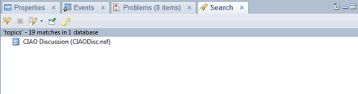
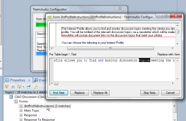
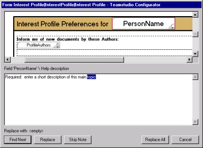
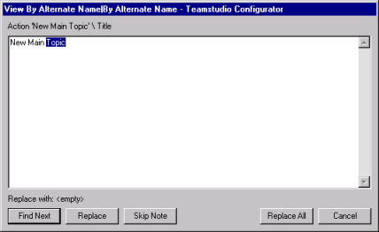
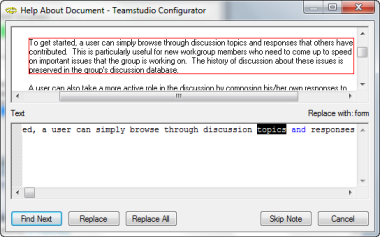
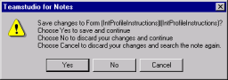

# When Configurator Finds a Match

If you've used Configurator through Designer's Search menu, you'll see the search result summary in the search tab at the bottom of the window. 
<figure markdown="1">
  
</figure>

You can drill down to the matched item where you can decide what action Configurator should take. 
<figure markdown="1">
  
</figure>

The information you see when Configurator finds a match will vary depending on the element type. If the match is in an area that can use the preview pane, for example, a visual element or static text, then you see the split window with the match highlighted. 
<figure markdown="1">
  
</figure>

For simple text and code matches, you see the matched text in context as shown. 
<figure markdown="1">
  
</figure>

The window title reflects the name of the Note where the match is found.

From this window, you can do the following:

* Click **Find Next** to locate the next match, which may be within the same dialog box.
* Click **Replace** to replace the highlighted match text, and locate the next match.
* Click **Skip Note** to continue to the next element or document (if changes have been made, a dialog box displays asking if you want to save the changes, before continuing to the next element or document).
* Click **Replace All** to replace the current selection, and automatically replace all other matches in the database.
* Click **Cancel** to cancel the search.
 
!!! note
    To make a manual change to text, edit in the highlighted area and click Find Next. 
 
If the match occurs in static text on a form, subform or in help\using or help\about, the text appears in context on the form or subform in the top half, and an editable version of the text appears in the bottom half of the window. 
<figure markdown="1">
  
</figure>

You can click the **Replace** button to replace the highlighted text and move on to the next match, or you can manually edit any of the text you see in the lower half of the window and then click **Find Next**.

!!! note
    If you make a change, and click **Skip Note**, Configurator prompts you to save or discard changes made to that point for the element being processed, or to cancel the action. Clicking **Cancel** will only cancel the Skip Note operation. Processing will continue with the next element found to match, if any. 
 
Once Configurator finds all of the matches in a particular design element (and you have not clicked **Skip Note** to stop processing that element), if you have made any changes (either replacements or manual edits), Configurator asks if you want to save the element before continuing. 
<figure markdown="1">
  
</figure>

You click one of the following:

| Choice | Action |
| --- | --- |
| Yes | Configurator saves the changes you made within this design element and continues to the next match. |
| No | Configurator discards any changes you made in this design element, and continues to the next match. |
| Cancel | Configurator discards any changes you made to this design element, and restarts the search at the beginning of the same element. This gives you a chance to undo any changes you have made to this design element and start over. |