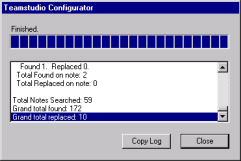
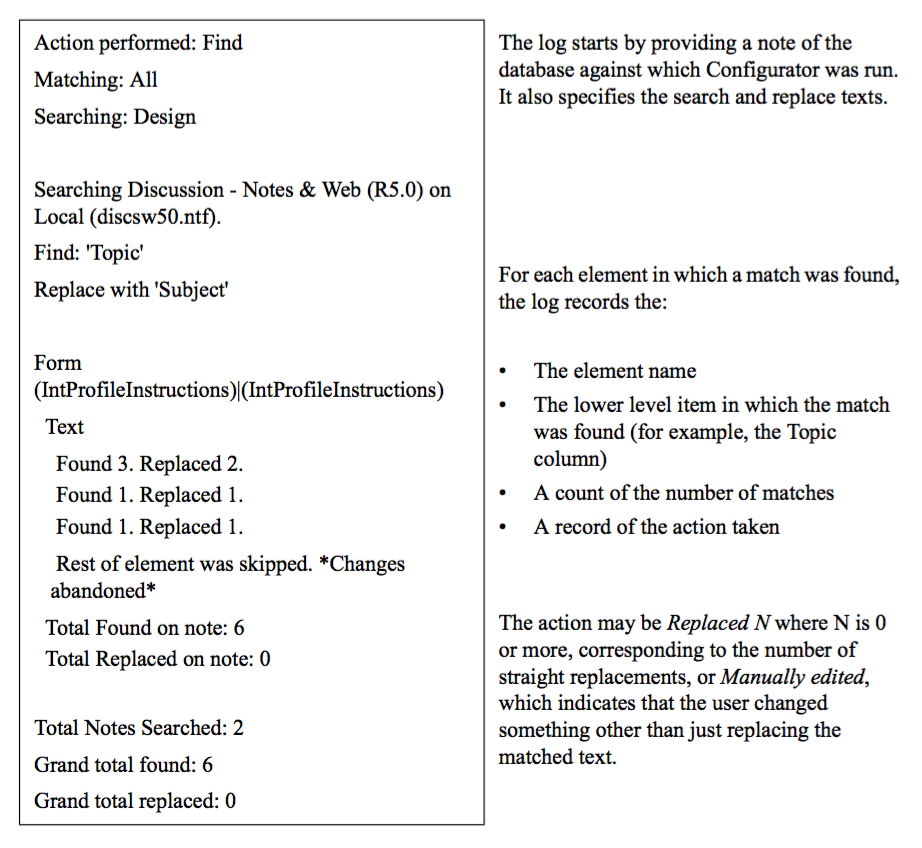

# Viewing the Configurator Output Log

As matches are found in the target database, Configurator stores the following information in an on-screen log as well as in the optional output database:

* Where the match was found
* What action was taken
* A summary count of matches and/or replacements per element
* Any skipped notes
* If the changes made were cancelled
* The total number of notes searched
* The total number of matches
* The total number of replacements
* Any errors that occurred during the action

See [Specifying Where to Store Configurator Results](results.md) for more information on the output database.

The following is an example of the on-screen output log. 
<figure markdown="1">
  
</figure>

 
When the search/replace action is complete, you can scroll through this log. You can also copy this log to the clipboard, by clicking the **Copy Log** button. This allows you to create a full report of the changes that have been made in another application, such as Notepad or Microsoft Word.

Before you run Configurator, you can optionally create a database to store the output log. The information you see in the output log database and in the on-screen log are identical. 

The following is an example of the contents of a Configurator output log. 
<figure markdown="1">
  
</figure>

Where a match has been found in static text, the text is divided into blocks, each of which represents a block of text in the same font face. Each block has a separate entry in the log. 
