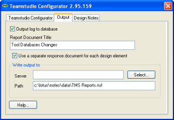

# Configurator の結果の保存場所の指定 

Configurator のアクションが完了すると、その結果が画面上のログに表示されます。Configurator を使用して加えた変更の履歴として、ログをノーツデータベースに保存することもできます。

## Configurator の結果を出力データベースに保存するには
1. **[ 出力 ]** タブから、**[ 出力ログをデータベースへ保存 ]** チェックボックスをオンにします。
2. オプションとして、**[各設計要素に別の返答文書を使う]**をオンにし、すべての結果を 1 つの長い文書に表示するのではなく、各要素の結果を文書に表示できるようにします。 
    
3. **[ レポート文書のタイトル ]** ボックスで、レポートのタイトルを入力します。
4. **[ 選択 ]** をクリックし、レポートを保存するデータベースを検索します。  
   レポートテンプレートに基づくデータベースのみが表示されます。レポートテンプレート名は TMSLogs、ファイル名は **tmslogs.ntf** です。  
   – 既存のデータベースを選択するか、新規データベースのサーバーおよびパス名を指定します。

新たに出力データベースを作成する場合は、TMSLogs テンプレートに基づいて作成されます。同一の出力データベースに、複数のデータベースの Configurator レポート文書を保存することができます。

!!! note
    分析対象のデータベースが同じであるか異なっているかにかかわらず、レポートタイトルは、Configurator を実行するたびに変更してください。これによって、出力データベース内のログレポートを容易に検索することができます。